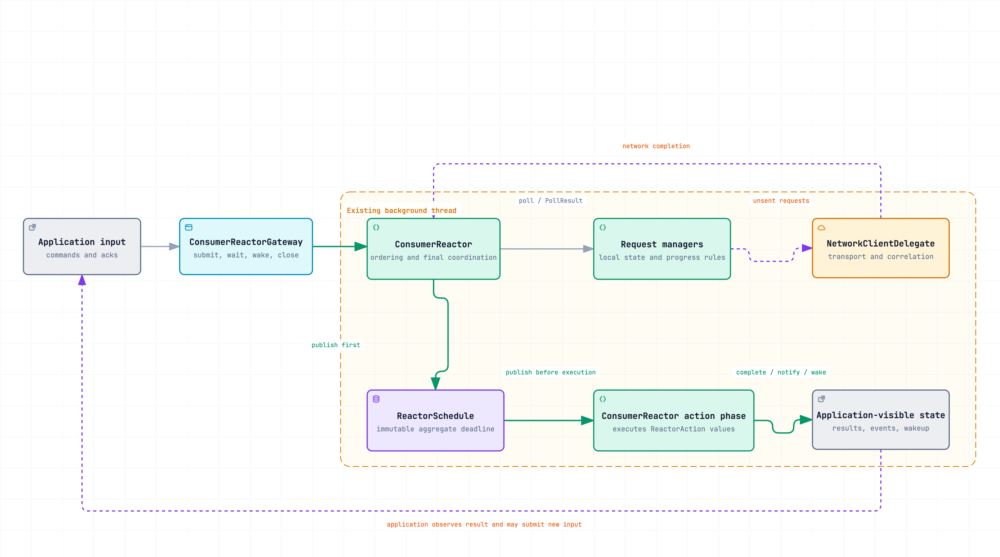
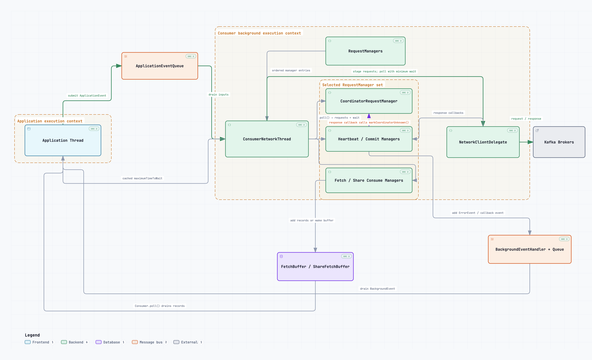
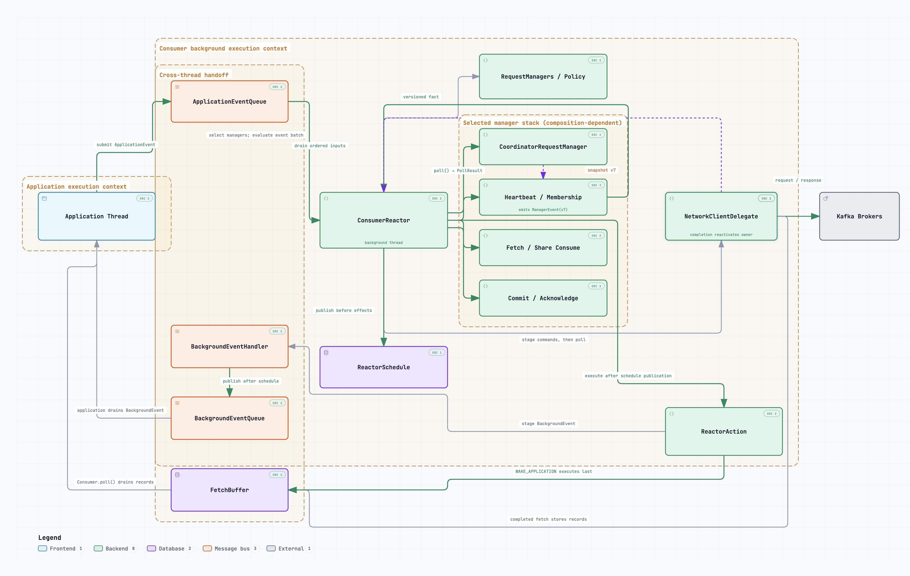
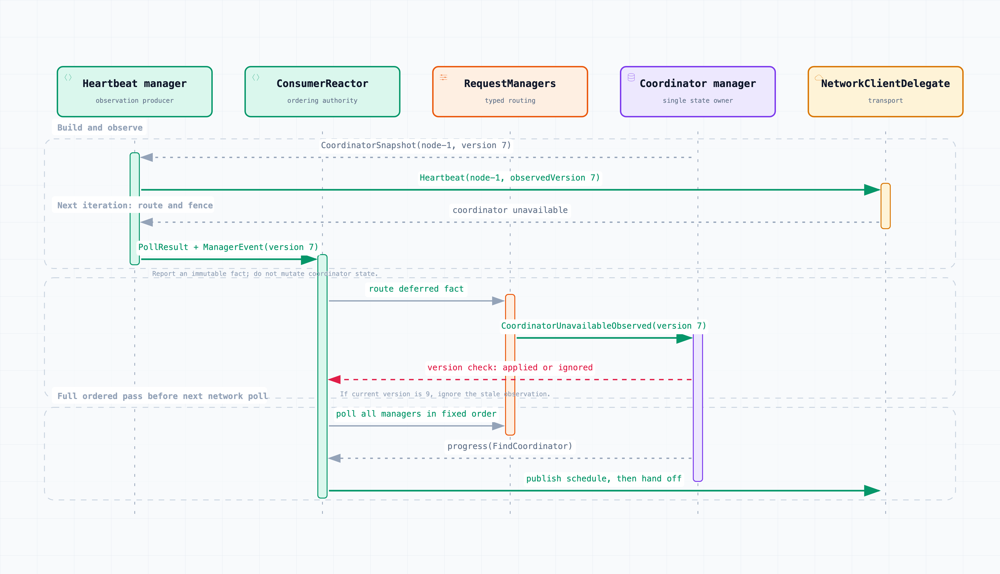

<!--
 Licensed to the Apache Software Foundation (ASF) under one or more
 contributor license agreements.  See the NOTICE file distributed with
 this work for additional information regarding copyright ownership.
 The ASF licenses this file to You under the Apache License, Version 2.0
 (the "License"); you may not use this file except in compliance with
 the License.  You may obtain a copy of the License at

    http://www.apache.org/licenses/LICENSE-2.0

 Unless required by applicable law or agreed to in writing, software
 distributed under the License is distributed on an "AS IS" BASIS,
 WITHOUT WARRANTIES OR CONDITIONS OF ANY KIND, either express or implied.
 See the License for the specific language governing permissions and
 limitations under the License.
-->

# KIP-1371: Introduce a Consumer Reactor for State Management and Event Processing

## Status

Current state: Draft

Discussion thread: TBD

Jira: [KAFKA-20995](https://issues.apache.org/jira/browse/KAFKA-20995)

## Summary

Request-manager waiting has three distinct conditions: work is available now, time may make work eligible, or an
external input must arrive first. The current deadline-based result records only when another poll may occur. For an
empty result, it does not identify which condition applies.

The async regular and share consumers already use a background loop and request managers, but wait, wakeup,
completion, and publication decisions remain distributed across paths that may observe different state. This has
contributed to busy loops, wakeup defects, stale completion handling, and state-publication races.

This KIP refactors that background loop into `ConsumerReactor`. Managers retain local state and policy while reporting
produced work and one typed next-poll condition. The reactor orders inputs, combines manager timing into one immutable
scheduling publication, and then releases the corresponding application-visible effects. During migration, the
publication carries separate reactor and application-wait projections.

The proposal applies to `AsyncKafkaConsumer`, `ShareConsumerImpl`, and Streams paths using the async background
kernel. It preserves thread topology, protocols, public consumer APIs, callback execution, and consumer-specific
rules. `ClassicKafkaConsumer` keeps its existing execution model.

The community decision covers typed manager output, single-owner cross-manager state changes, publication before
reactor-owned application effects, and the four diagnostic counters in Public Interfaces. Internal class placement,
protocol-driver extraction, and POC lifecycle experiments remain implementation or follow-up work.

## Motivation

A local deadline can be urgent even when the Consumer as a whole cannot make progress. Today, no single component
combines those facts before selecting the next wait or application-visible action.

### A motivating failure: urgent work without progress

[KAFKA-20253 / PR 22836](https://github.com/apache/kafka/pull/22836) fixed a high-CPU loop after failed
re-authentication. Once the coordinator became unavailable, a heartbeat could be due but could not be sent. At the
same time, coordinator discovery or auto-commit could already be in flight. Two zero-delay paths were enough to spin
the application and background threads, and auto-commit had the same missing check for whether it could make
progress:

| Component | Local observation | Local result | Global reality |
| --- | --- | --- | --- |
| Heartbeat request manager | The heartbeat deadline had expired and no heartbeat was in flight. | Application wait `0`. | No coordinator existed, so no heartbeat request could be created. |
| Coordinator request manager | The retry backoff had elapsed. | Network poll delay `0`. | A `FindCoordinator` request was already in flight, so another request could not be created. |
| Auto-commit state | The commit interval had elapsed. | Application wait `0`. | A previous commit was still in flight, so another commit could not start. |

The application thread repeatedly observed a zero wait, while the background thread repeatedly called
`NetworkClient.poll(0)`. Both threads ran, but neither could change the state required for progress.

PR 22836 correctly added guards that check whether the affected path can make progress now by producing a request or
completed state transition. This fixed the bug, but it also demonstrates the maintenance problem: the result type did
not distinguish "retry now" from "nothing can change until another event." Diagnosing the failure required
correlating manager timers, in-flight state, the previously published wait used by the application thread, and the
network poll timeout.

### Bug evidence

KAFKA-20253 is one instance of a recurring failure pattern. The affected features differ, but each case involved
decisions made on separate paths that could observe different snapshots of consumer state.

| Evidence | Observed failure | Decisions split across paths |
| --- | --- | --- |
| [KAFKA-17066 / PR 16885](https://github.com/apache/kafka/pull/16885) | Position initialization crossed application and background ownership. | Assignment input, position mutation, and background execution ownership. |
| [KAFKA-17674 / PR 17342](https://github.com/apache/kafka/pull/17342) | An older position-initialization completion could affect a partition added while its request was in flight. | Assignment changes, the captured partition scope, and completion handling. |
| [KAFKA-18641 / PR 18737](https://github.com/apache/kafka/pull/18737), [KAFKA-15529 / PR 21476](https://github.com/apache/kafka/pull/21476) | Position and consumed-state publication could race with commit or background fetch observation. | State mutation, publication, and dependent observation. |
| [KAFKA-20426 / PR 22018](https://github.com/apache/kafka/pull/22018), [KAFKA-20253 / PR 22836](https://github.com/apache/kafka/pull/22836) | Heartbeat urgency produced a zero wait while coordinator, assignment, or in-flight state made progress impossible. | Manager deadlines, progress blockers, application waiting, and network polling. |
| [KAFKA-20854 / PR 23014](https://github.com/apache/kafka/pull/23014) | An ambiguous empty fetch result caused application/background wakeup ping-pong. This was primarily a wake/effect-classification defect, not a deadline-model defect. | Fetch result classification, application waiting, and an application wakeup that did not correspond to progress. |
| [KAFKA-20970 / PR 23227](https://github.com/apache/kafka/pull/23227) (proposed, not merged) | An expired auto-commit or Streams heartbeat compatibility timer could remain at zero while the coordinator was unknown and no request could be built. | Manager eligibility, legacy application-wait projection, and network poll timeout. |
| [KAFKA-20397 / PR 21991](https://github.com/apache/kafka/pull/21991) (proposed, not merged) | Metadata-error publication raced with an application thread entering its fetch-buffer wait. | Error publication, retained notification, and wait entry. |
| [KAFKA-18160 / PR 18089](https://github.com/apache/kafka/pull/18089) | Wakeup or interruption could skip callback acknowledgement. | Interruption, callback completion, and lifecycle handling. |
| [KAFKA-19357 / PR 19914](https://github.com/apache/kafka/pull/19914), [KAFKA-18569 / PR 18590](https://github.com/apache/kafka/pull/18590) | During close, coordinator discovery could stop while a pending commit still required it, or continue after commit and leave work no longer required it. | Pending-operation dependencies, coordinator discovery, and shutdown progress. |

All pull requests in this table are merged except PR 21991 and PR 23227, which are marked above as proposed.

These issues share one narrower failure shape: a wait, wakeup, completion, or state-publication decision was made by a
component that could not atomically observe all state on which the decision depended. This KIP does not claim that one
call mechanism directly caused every issue. KAFKA-20253, for example, was fixed by correcting local progress checks.

## Public Interfaces

The initial migration changes no Kafka protocol, public `Consumer` or `ShareConsumer` API, callback execution
guarantee, runtime thread name, or existing metric name. `Consumer.wakeup()` retains its current user-visible
semantics. The coordination types described in Proposed Changes are internal. The implementation adds four public
diagnostic counters:

| Metric name | Group | Type and scope | Incremented when | Operational use and stability |
| --- | --- | --- | --- | --- |
| `reactor-invalid-poll-result-total` | `consumer-metrics` or `consumer-share-metrics` | Monotonic cumulative counter per client instance. | A typed or fully migrated producer returns an empty `PollImmediately` result. | A non-zero value identifies an invalid manager result and a prevented busy-loop condition. Name and cumulative meaning are stable after release. |
| `reactor-manager-poll-failure-total` | `consumer-metrics` or `consumer-share-metrics` | Monotonic cumulative counter per client instance. | A request-manager poll throws an unexpected runtime exception. | Diagnoses a manager execution failure without requiring manager-name tags. Name and cumulative meaning are stable after release. |
| `reactor-action-failure-total` | `consumer-metrics` or `consumer-share-metrics` | Monotonic cumulative counter per client instance. | A selected application-visible `ReactorAction` fails during execution. | Distinguishes effect-delivery failure from manager or transport failure. Name and cumulative meaning are stable after release. |
| `reactor-application-wakeup-total` | `consumer-metrics` or `consumer-share-metrics` | Monotonic cumulative counter per client instance. | The reactor invokes the primitive application-thread wakeup after phase coalescing. | Its rate helps detect wakeup ping-pong; the absolute total is not by itself an error signal. Name and cumulative meaning are stable after release. |

These metrics follow the existing async-consumer metric lifecycle: they inherit the client metric registry's common
tags, introduce no manager/event/reason tag, and are removed when the consumer metrics manager closes. Recording is
constant-time and performs no event-list formatting or dynamic metric registration on the reactor hot path. A
diagnostic counter is not a recovery mechanism: after an invalid poll result the reactor must prevent the immediate
retry, so a busy loop cannot continue merely to generate the metric. Tests cover registration, recording, and
removal call paths. Registration and removal are verified in both metric groups. Counter-value assertions in both
groups remain an implementation gate.

Any future public capacity configuration or overload behavior requires a separately complete compatibility
proposal.

## Proposed Changes

### Reactor model in a nutshell

A request manager owns one domain of mutable state and policy, such as heartbeat, commit, fetch, or coordinator
state. `ConsumerReactor` owns the ordered iteration that combines manager outputs. In each iteration it:

1. applies admitted application inputs and manager-to-manager commands;
2. polls every selected manager in a stable order;
3. stages transport intents and routes facts that require work outside the producing manager;
4. retains each manager's next-poll requirement in `ManagerPollCache`;
5. publishes both scheduling projections atomically in one `ReactorSchedule` generation for that phase; and
6. executes the corresponding application-visible effects.

This ordering gives the application thread one published view of state and timing before it observes a completion,
notification, or wakeup. It does not move heartbeat, commit, fetch, coordinator, regular-consumer, or share-consumer
policy into the reactor.

For example, when a heartbeat is due while coordinator discovery is in flight, the heartbeat manager produces no
request. It reports that only the discovery completion can make another heartbeat poll useful. The coordinator
completion reactivates the background loop, every manager observes the updated coordinator state in the next ordered
pass, and the reactor publishes the new timing decision before releasing any resulting application effect.

One manager poll returns one `PollResult`. The result is a typed envelope with three independent outputs:

1. **`ManagerEvent`: an immutable fact.** For example, fetch reports that buffered data is available, or heartbeat
   reports that the coordinator used by its completed request is unavailable. A composition-owned coordination
   policy maps the ordered event batch to commands for a state owner or to application-facing effects. The reactor
   performs only generic collection and ordering; it does not contain a switch for fetch, heartbeat, commit, regular,
   or share policy.
2. **`NetworkCommand`: an intent for the transport owner.** For example, a heartbeat manager asks
   `NetworkClientDelegate` to stage a built heartbeat request. The command is not evidence that the request has
   already been sent; connection selection, transmission, correlation, and timeout handling remain transport work.
3. **`NextPollCondition`: the manager's next local activation condition.** `PollImmediately` is legal only after the
   same result produced output, `RetryAfter(delayMs)` means time alone may make work possible, and `AwaitInput` means
   only a new application input, network completion, cancellation, shutdown, or another explicitly admitted input
   can change the answer.

The envelope deliberately separates a fact, an intent, and a wait condition. They are all manager outputs, but they
do not have the same handling rule. Calling every value an event would hide whether the reactor must evaluate a
policy, stage transport work, or retain a deadline.

The remaining concepts describe how those outputs form one reactor iteration:

| Concept | Scoped meaning | Concrete example |
| --- | --- | --- |
| `PollResult` | One manager's complete atomic output for this poll. | Heartbeat returns one `NetworkCommand` plus `AwaitInput(network completion)` after recording the request in flight; an in-flight discovery also returns no immediate output plus `AwaitInput`. |
| `ManagerEvent` | A fact produced by one manager that requires a consequence outside that producer's local state. | `FetchBufferHasData` derives a post-publication application wake; `CoordinatorUnavailableObserved(version=7)` derives a version-fenced command for the coordinator owner. |
| Owner snapshot | An opt-in immutable, versioned view used only when another manager needs coherent owner state. | Heartbeat builds for `CoordinatorSnapshot(node-1, version=7)` and retains version 7 so its later observation cannot invalidate version 9. |
| `ManagerCoordinationPolicy` | Composition-owned typed handlers that map an ordered event batch to `ManagerCommand` or `ReactorAction` values. | It maps `FetchBufferHasData` to one coalesced wake and routes a coordinator observation to the coordinator owner without adding domain branches to `ConsumerReactor`. |
| `ReactorSchedule` | One immutable scheduling publication. It contains the retained reactor deadline and, during migration, a separate application-wait projection. | Fetch can retry in 100 ms and heartbeat in 50 ms, so the next network poll is bounded to 50 ms; a legacy 25 ms application wait remains separately identifiable. |
| `ReactorAction` | An application-facing effect executed by `ConsumerReactor` only after the corresponding state and schedule are published. | Complete an async poll, publish a metadata error, or perform one phase-coalesced application wake. |

The model has three invariants:

1. **One state owner.** Each mutable state has one execution-context owner. Another ownership domain may read an
   immutable snapshot or report a `ManagerEvent`, but it may not mutate that state directly. Components deliberately
   grouped behind one protocol driver, such as heartbeat and membership state for one group protocol, may still call
   one another because the driver defines them as one ownership domain.
2. **No wakeup without a cause.** Every application wakeup or timed reschedule corresponds to produced work, a
   typed retry condition, an input, or a capacity change. An empty manager result cannot claim that work was
   produced.
3. **Publish before effect.** State and the resulting `ReactorSchedule` are published before any corresponding
   `ReactorAction` or staged application event is released.

### 1. Define the responsibility boundary

Today, `AsyncKafkaConsumer` and `ShareConsumerImpl` each create a background execution context. They reuse the same
event-loop and network infrastructure, but state, wait, completion, publication, and wakeup decisions can still be
made by different components along the path. The proposal changes responsibility, not topology:



Before this KIP, `ConsumerNetworkThread` already drains application inputs, polls the selected request managers,
stages their unsent requests, and bounds network polling by the minimum numeric wait. The paths after a manager or
network completion are component-specific: heartbeat and commit paths can update coordinator state; fetch paths
store records in `FetchBuffer` or `ShareFetchBuffer` and wake that buffer; managers can publish directly through
`BackgroundEventHandler`; and operation futures are completed by their owning managers. The diagram describes the
existing coordination shape; it does not imply that every path is independently defective.



Both diagrams trace the same representative case: a heartbeat or commit response observes that the coordinator it
used is unavailable. Before the KIP, that response callback can directly call `markCoordinatorUnknown()` on the
coordinator manager. After the KIP, the producing manager reports a versioned fact; the selected composition derives
one command; and only `CoordinatorRequestManager` validates the observed version and changes coordinator state. The
fetch-buffer and background-event paths remain visible in both diagrams to show how that coordination case fits into
the complete application/background data flow.

The following topology expands that boundary into the full runtime path. `AsyncKafkaConsumer`, the Streams-enabled
regular consumer, and `ShareConsumerImpl` select different `RequestManagers` compositions while using the same
reactor phases. The manager stack in the diagram is representative: each composition supplies only its applicable
coordinator, heartbeat or membership, fetch or share-consume, and commit or acknowledgement managers. Application
commands enter through `ApplicationEventQueue`. Network completions activate the owning manager; completed fetches
enter `FetchBuffer` or `ShareFetchBuffer`; and application-visible `ReactorAction` values are executed by
`ConsumerReactor` only after `ReactorSchedule` publication. `BackgroundEventHandler` stages and publishes events to
the cross-thread `BackgroundEventQueue`, which the application thread drains. The background-event and fetch-buffer
paths therefore return data, notifications, and wakeups to the application thread. Kafka brokers remain outside the
consumer execution contexts.



| Component | Target responsibility after the KIP |
| --- | --- |
| `ConsumerReactor` | Order inputs, invoke managers in a fixed order, retain their timing contributions, publish the final timing decision, and then execute application-visible effects. |
| `RequestManagers` composition | Select the regular, share, or Streams manager set, own its typed event handlers, and apply derived `ManagerCommand` values to one state owner. |
| Request manager | Own one domain of mutable consumer state and decide whether it can produce work now, needs a finite retry, or must wait for another input. It may publish a small immutable snapshot when another manager needs a coherent view. |
| Regular / share / Streams protocol driver | Keep membership, assignment or acquisition, commit or acknowledgement, topology, and callback coordination outside the shared reactor loop. These are proposed internal boundaries, not current code types. |
| `NetworkClientDelegate` | Own transport, connection handling, request correlation, and timeouts; do not decide whether to complete an application event or wake the application thread. |
| Application thread | Execute user callbacks and consume published data, events, and operation results. |

The reactor coordinates these owners; it does not absorb their local rules or transport mechanics. A manager's
`NetworkCommand` is handed to `NetworkClientDelegate`; it is neither a `ManagerEvent` nor an application-visible
`ReactorAction`.

### 2. Define manager poll results

A manager poll answers one narrow question: what did this manager produce now, and what can make another poll useful?
The manager owns the state needed to answer, such as coordinator availability, in-flight requests, retry backoff,
metadata, or buffer capacity. The reactor validates and routes the typed answer but does not reimplement those rules.

A deadline can express when to poll again, but not whether another poll can make progress or what must happen first.
It compresses a request manager's distinct next-poll conditions—whether it can build an `UnsentRequest` now, whether
a retry delay must elapse, or whether coordinator state, an in-flight request, or another external input must change—
into one number. Before this proposal, `PollResult` pairs a list of `UnsentRequest` values with
`timeUntilNextPollMs`. Request presence shows that transport work was produced. For an empty result, however, the
number says only when another poll may occur. It does not state whether passage of time can change eligibility or
whether progress requires an external input. Existing code represents those cases by convention: `0` means immediate
re-evaluation, a finite value represents a timed retry, and `WAIT_FOREVER` removes the timer deadline.
These conventions can produce the intended scheduling behavior, but leave the eligibility condition and blocking
cause implicit.

The manager must not encode the same feasibility rule independently in work admission and wait calculation. For each
migrated work source, it derives one manager-local activation projection that answers both:

1. whether a local step is legal now; and
2. after that step, whether time or another input can make the next poll useful.

This is a local calculation over state the manager already owns, not a global readiness registry. It may be a private
method or small private value; the KIP does not require a new framework or class hierarchy. The resulting condition is
published through the existing `PollResult` type.

`PollResult` has the following form:

```java
record PollResult(
    List<NetworkCommand> networkCommands,
    List<ManagerEvent> events,
    NextPollCondition nextPoll
) {}

PollResult.progress(networkCommands, events, nextPollCondition);
PollResult.retryAfter(delayMs);
PollResult.awaitInput(cause);
```

Three examples show why the pre-step and post-step conditions must be derived from the same state projection:

```text
Coordinator discovery
  retry elapsed, no request in flight -> PollImmediately -> build one request
  after recording the request in flight -> AwaitInput(network completion)

Auto-commit
  timer not expired -> RetryAfter(remainingMs)
  timer expired, no commit in flight -> PollImmediately -> enqueue one commit
  timer expired, commit in flight -> AwaitInput(commit completion)

Regular/share heartbeat
  coordinator unknown or membership blocks heartbeat -> AwaitInput(owner state change)
  interval/backoff pending -> RetryAfter(remainingMs)
  request legal now -> PollImmediately -> build one heartbeat
  after recording the heartbeat in flight -> AwaitInput(network completion)
```

Reusing the pre-step `PollImmediately` condition after creating a request would admit a duplicate or immediate loop.
Using an arbitrary timer while a request is in flight avoids that loop but periodically rechecks work that only a
completion can enable. The single local projection removes both forms of disagreement. During migration,
`maximumTimeToWait(...)` remains a separate compatibility projection for the application thread; it is not converted
into a manager retry condition. The scheduling publication carries that application projection separately from the
manager's reactor deadline. A migrated manager should derive both projections from the same local activation
calculation rather than reproduce its eligibility predicate.

| Result shape | Immediate output | Meaning |
| --- | --- | --- |
| `progress(...)` | At least one `ManagerEvent` or `NetworkCommand`. | Consume the output now; the typed condition describes the next poll after that output. |
| `retryAfter(delayMs)` | None. | Time alone may make the manager runnable; poll again after the non-negative configured delay. |
| `awaitInput()` | None. | Time alone cannot help; poll again after a relevant admitted input. |

Once a feature and operating mode are fixed, timing-only configurations should control cadence, retry spacing, and
timeout budgets. They should not be reused as proxies for whether work is currently eligible or which external input
must occur before progress can resume. This does not imply that Kafka configuration never changes state-machine
behavior; feature, protocol, and timeout settings intentionally do so.

`RetryAfter` accepts every non-negative configured delay. `RetryAfter(0)` is a time-driven retry, not an input wait
and not proof that work was produced. It makes the manager eligible in the next stable manager pass after the reactor
has completed the current transport/input phase. A manager is polled at most once in each stable pass, so one zero
retry cannot recursively poll that manager within the phase. A configuration that deliberately selects zero
backoff may still request consecutive zero-delay iterations; the KIP prevents semantic ambiguity, not CPU use that
follows from an explicit zero-backoff configuration.

Deadline conversion uses saturating arithmetic. A configured `Long.MAX_VALUE` delay remains a time-driven retry with
an absolute deadline saturated at `Long.MAX_VALUE`; it is not converted to `AwaitInput`. Tests must cover zero,
maximum, overflow, repeated-zero fairness, and the distinction between an empty `RetryAfter(0)` and the invalid empty
`PollImmediately` shape.

`PollImmediately` is not a general zero-delay retry. It is valid only when the same `PollResult` contains output that
the reactor consumes or stages. This makes the invalid shape structural rather than a convention:

```text
events=[] + networkCommands=[] + nextPoll=PollImmediately
```

The empty output says that no progress occurred, while the zero delay asks for an immediate retry. Returning the same
shape repeatedly creates a busy loop. A manager returning `progress(...)` must also consume or mark its output in
flight so that the next poll cannot emit the same logical progress again.

`AwaitInput` does not subscribe to or name one `ManagerEvent`. It means that this manager has no time-based deadline.
For an in-flight coordinator discovery, the enabling input is that request's network completion; for an in-flight
commit, it is that commit's completion; for paused fetch partitions, it may be an application resume or assignment
change. The existing bounded network poll is a safety safeguard, not a semantic retry interval.

Examples across managers are:

| Manager state | Result | Related evidence |
| --- | --- | --- |
| Coordinator retry backoff has 75 ms remaining. | `retryAfter(75)` | Finite-retry case |
| Fetch preparation finds buffered data. | `progress([], [FetchBufferHasData], AwaitInput)`; policy derives a post-publication wake. | [KAFKA-20854 / PR 23014](https://github.com/apache/kafka/pull/23014) |
| Fetch request is in flight. | `awaitInput()`; the fetch response or disconnect is the enabling input. | Expected in-flight wait case for KAFKA-20854 |
| Topic-metadata request is in retry backoff. | `retryAfter(remainingBackoffMs)` | Finite-retry case |
| Share acknowledgement request is in flight. | `awaitInput()`; acknowledgement completion is the enabling input. | Share-consumer case |

`AwaitInput` carries a diagnostic cause; it does not subscribe the manager to a second notification mechanism. Every
production use must identify an existing input path that activates the reactor and must have a deterministic liveness
test:

| Waiting state | Enabling input and producer | Required evidence |
| --- | --- | --- |
| Coordinator discovery, heartbeat, commit, fetch, or acknowledgement request in flight | Completion, disconnect, cancellation, or timeout returned by `NetworkClientDelegate.poll()` | The owning manager is re-polled after the completion and its new condition is published before the next network poll. |
| Heartbeat or commit waiting for an unknown coordinator | Coordinator discovery completion applied by `CoordinatorRequestManager` | The next stable manager pass observes the new coordinator before the next network poll. |
| Paused or unfetchable partitions | Resume, assignment, metadata, or subscription input admitted through the existing application/background channels | Each supported input wakes the blocked path without periodic manager polling. |
| Shutdown or operation cancellation | Existing shutdown or application-command wake path | The waiter reaches the existing terminal behavior without relying on the bounded network-poll safeguard. |

Classification tests alone do not prove this liveness property. A producer remains Partial until the named enabling
input is exercised through the production component path. The bounded network poll remains a safeguard and is not a
substitute for that proof.

Strict factories validate only these generic result-shape rules. They do not infer why heartbeat, commit, fetch,
coordinator, or share work can make progress. During migration, `UnsentRequest`, raw-delay fields, and compatibility
constructors remain adapters around the typed fields and factories. `StateTransition` has been removed; manager facts
now use only `ManagerEvent`. The current POC records an empty immediate adapter result and contains it as
`AwaitInput`. A raw adapter cannot distinguish an invalid immediate retry from a legal time-driven zero retry, so
this containment is not the target compatibility behavior. Remaining zero-delay producers must emit typed
`RetryAfter(0)` before the adapter can be removed or treated as an invariant violation.

### 3. Publish one scheduling decision before executing effects

For every manager result, the reactor interprets `NextPollCondition` generically. `RetryAfter` and
`PollImmediately` become an absolute manager deadline; `AwaitInput` withdraws that manager's finite deadline.
`ReactorSchedule` is the immutable publication of the retained deadlines. It selects the earliest deadline, so
updating one manager cannot erase an earlier deadline from another manager and an unrelated early network return
cannot postpone existing work.

The deadline means that the reactor must activate by that time. It does not select which manager runs and does not
promise that network I/O occurs exactly then. Network I/O, application input, cancellation, or shutdown may wake the
loop earlier. The same publication supplies both the network poll bound and the application thread's current wait
projection. During migration these remain distinct inputs: `NextPollCondition` contributes the manager's reactor
deadline, while the legacy compatibility path contributes the application deadline formerly returned by
`maximumTimeToWait(...)`.

One iteration may publish a newer `ReactorSchedule` generation after network completions. Each generation contains
both projections from one publication phase.

The schedule has these properties:

- a shorter deadline is published before a waiter using an older value is released;
- an early finite re-poll cannot move an unexpired manager deadline later;
- `AwaitInput` withdraws that manager's prior finite deadline because time alone can no longer help;
- an expired deadline is consumed by polling the manager again rather than repeatedly waking the application; and
- an event-only wait does not create a periodic manager poll.

`ReactorAction` represents an application-visible effect such as an async-poll completion or application wakeup.
Network commands remain transport intents, next-poll conditions remain timing contributions, and manager commands
remain targeted state-owner intents; none of those are `ReactorAction` values. The ordering rule is:

> Apply owner state updates, publish state and `ReactorSchedule`, then execute the corresponding `ReactorAction`
> values.

Equivalent wake reasons may share one primitive application wakeup, but terminal operation completions are never
merged. Wakeup executes last so the application thread can observe the state, schedule, data, event, or completion
that caused it. An action failure is logged, counted, and isolated; it cannot suppress later independent actions or
network I/O.

#### Lifecycle compatibility

Existing public timeout, cancellation, interruption, close, and fatal-error behavior remains the compatibility
baseline. The reactor model does not define a new generic cancellation protocol or permit new retries and
broker-visible work after an operation reaches its existing terminal boundary. POC experiments concerning bounded
daemon cleanup, fatal cutoffs, and cancellation routing are evaluated separately from this proposal. A later change
to those semantics requires its own ownership rules and production-path tests.

#### Example: two managers with different deadlines

Assume fetch reconnect backoff expires in 100 ms while heartbeat must be polled in 50 ms:

```text
FetchRequestManager.poll()     -> retryAfter(100)
HeartbeatRequestManager.poll() -> retryAfter(50)

ConsumerReactor
  -> publishes ReactorSchedule(deadline=heartbeat at 50 ms)
  -> does not wake the application
```

At 50 ms, the reactor polls heartbeat work. The retained fetch deadline remains at 100 ms even if heartbeat network
I/O returns early. At 100 ms, fetch is polled again. Backoff and in-flight states do not wake the application because
they are not application-visible progress.

### 4. Process one reactor iteration

An input event is an existing application command, network completion, deadline expiry, network send capacity
becoming available, or callback acknowledgement. It is a semantic term, not a requirement to add another queue:
application commands use the existing
`ApplicationEventQueue`, while network completions occur directly during `NetworkClientDelegate.poll()` on the
reactor thread.

Input events are not merged into one state mutation. The reactor applies them in a deterministic order, then polls
the manager set in its fixed composition order and aggregates the results. Requests, callbacks, and terminal
operation results retain their identities and ordering. Equivalent application wake reasons may share one primitive
wakeup while all reasons remain observable.

For example, if an assignment adds `tp2` before an older `OffsetFetch(scope={tp1})` completes, the assignment event is
applied first and the older completion can update only `tp1`. A later ordered position operation initializes `tp2`.

One reactor iteration is event-driven with deadline-bounded waiting:

1. Apply `ManagerCommand` values derived from the previous post-I/O completion phase to their single state owners
   through the selected regular or share composition.
2. Drain producer-local `ManagerEvent` values recorded by response callbacks, evaluate that input-boundary batch,
   and apply its owner commands. This occurs before any manager can build transport work from owner state.
3. Drain ready application commands and callback acknowledgements and apply them through the same composition.
4. Capture the current references to any opt-in owner-published snapshots used by new cross-manager work in this
   ordered pass.
5. Poll the stable manager set in order and collect their `PollResult` values.
6. Evaluate that phase's ordered `ManagerEvent` batch through `ManagerCoordinationPolicy`, stage every
   `NetworkCommand`, and retain each manager's `NextPollCondition`.
7. Form and publish one `ReactorSchedule`, publish staged `BackgroundEvent` values, and execute the phase's
   `ReactorAction` values.
8. Poll network I/O no longer than the published deadline.
9. Re-poll each completion's owning manager, evaluate the post-I/O event batch, publish the updated schedule, then
   execute its actions. Any resulting cross-owner `ManagerCommand` is applied at the beginning of the next iteration,
   before the next full manager pass and before the next network poll.

Managers do not call one another recursively and do not invoke mutation methods across ownership domains. A network
completion updates its owning manager, which may return an immutable fact. Because I/O has already occurred, a
cross-owner command derived from that fact is applied at the beginning of the next iteration and dependent work is
produced by the next full ordered pass, before the next network poll. The reactor does not traverse a dependency graph
or repeatedly poll to a fixed point.

### 5. Route cross-manager observations to their state owner

Consider a heartbeat sent while the group coordinator becomes unavailable:

1. **Build from the current view.** The heartbeat manager reads the coordinator owner's published view:
   `(node-1, version 7)`. It builds the request for `node-1` and records version `7` with that request attempt.
2. **Observe, do not mutate.** The response reports that the coordinator is unavailable. The heartbeat manager does
   not change coordinator state. Its post-I/O `PollResult` reports
   `CoordinatorUnavailableObserved(observedVersion=7, cause)` as a `ManagerEvent`.
3. **Derive one owner command.** `ManagerCoordinationPolicy` handles the event and emits
   `InvalidateCoordinatorIfCurrent(observedVersion=7, cause)`. The reactor defers that `ManagerCommand` until the next
   iteration, then `RequestManagers` routes it to `CoordinatorRequestManager`, which owns coordinator state.
4. **Fence stale observations.** The owner compares version `7` with its current version. If rediscovery has already
   published version `9`, the old observation is ignored and cannot invalidate the newer coordinator.
5. **Re-evaluate every manager.** The reactor polls all managers in fixed order. The coordinator manager may produce
   a `FindCoordinator` request; heartbeat and commit wait for discovery rather than scheduling arbitrary retries.
6. **Publish the next wait.** The reactor publishes the resulting `ReactorSchedule` before releasing any
   application-visible effect. The `FindCoordinator` request is handed to the network layer before the next network
   poll.

Cross-owner facts have one normative admission rule: they must originate from an input or network-completion path and
must be available no later than the post-I/O owner poll. They must not be created for the first time by the ordinary
pre-I/O full manager pass. At that point other managers may already have built transport commands from the previous
owner snapshot, so applying a newly derived owner command would leave those commands stale. The POC retains and logs
such an unexpected pre-I/O fact as migration containment, then applies its command at the next input boundary. The
target model does not add dependency-aware request cancellation or replay; adding that mechanism requires separate
motivation and evidence.



#### Owner-published snapshots and stale-observation fencing

A snapshot is an opt-in cross-manager state view, not a required output of every `RequestManager`. A state owner
publishes a small immutable snapshot only when another manager needs a coherent set of decision-relevant fields.
Fields which must be observed atomically, such as coordinator target and coordinator version, belong to the same
snapshot. Snapshot versions are owner-local internal identities; they are not Kafka protocol `generationId` or
`memberEpoch` values. The owner increments the version only when published decision-relevant truth changes, not for
every poll, log, or metric update.

An admitted request captures the snapshot version and only the bounded target or scope required for that attempt. An
old version may remain as captured context for an in-flight request, but an old snapshot cannot admit new work. The
fencing path is:

```text
read current CoordinatorSnapshot(READY, node-1, version=7)
  -> build the heartbeat request and capture target=node-1, observedVersion=7
  -> the response produces CoordinatorUnavailableObserved(observedVersion=7, cause)
  -> a bounded pending slot retains the newest observation of that type
  -> the observation is returned in PollResult and routed to the coordinator owner
  -> the owner compares observedVersion with its current CoordinatorSnapshot version
  -> apply only if the versions still match; otherwise ignore the stale observation
```

If several observations arrive before publication, the producer-local slot retains the greatest observed version.
That bounded buffer does not decide whether an observation is current. The state owner always performs the final
comparison. Each producer retains at most one pending fact of each bounded type, the reactor retains it only until the
next routing phase, and in-flight work retains only the version and bounded request context rather than snapshot
history. `ReactorSchedule` is a timing publication, not a registry of manager domain state.

### 6. Preserve operation identity across retries

One application API operation may require several network attempts and several reactor iterations. Those identities
must not be conflated:

| Identity | Purpose |
| --- | --- |
| Operation identity | Associates the attempts and completions of one admitted application API call with its existing event and future. It is not assigned once per `ReactorAction`. |
| Request attempt identity | Distinguishes network attempts and retries within an operation; transport correlation remains in `NetworkClientDelegate`. |
| Owner snapshot version and scope | Prevents an older completion from mutating newer owner state or partitions outside the operation's captured scope. |
| Protocol generation or member epoch | Retains broker-defined group identity and fencing semantics; it is not reused as an internal snapshot version. |

One operation can span several schedule publications and network attempts before producing one terminal completion.
Conversely, one deduplicated wake action can notify the application about several progress reasons, so an action cannot
serve as the operation identity. The target ordering for `commitSync` encountering a coordinator change is a concrete
example:

```text
Application thread calls commitSync(offsets, timeout)
  -> one SyncCommitEvent and its future represent the pending commit operation

OffsetCommit attempt 1 returns NOT_COORDINATOR
  -> the commit operation remains pending
  -> CommitRequestManager reports CoordinatorUnavailableObserved with the request's coordinator version
  -> the next reactor iteration routes the fact to CoordinatorRequestManager
  -> CoordinatorRequestManager applies it only if that version is still current
  -> the full ordered pass schedules FindCoordinator without completing the commit

FindCoordinator response records the new coordinator
  -> the next full ordered pass lets commit and heartbeat observe the new coordinator snapshot
  -> OffsetCommit attempt 2 is sent for the same commit operation

OffsetCommit attempt 2 succeeds
  -> ConsumerReactor publishes the resulting schedule
  -> the terminal completion action completes the SyncCommitEvent future once
```

The two `OffsetCommit` attempts have separate transport correlation, but they do not become two application
operations. `FindCoordinator` is shared infrastructure work that may also unblock heartbeat, join, or other commit
work; it is not owned by the commit action. Pending operations remain in their existing managers rather than being
copied into an unbounded central dependency graph.

The reactor must preserve these existing identities rather than replace them with an action ID or schedule
generation. This KIP adds no public operation ID and does not redefine timeout, cancellation, interruption, close, or
terminal-completion semantics. Those behaviors remain with the existing operation owner and compatibility tests.

### 7. Share the reactor kernel, not consumer rules

The regular consumer and share consumer use separate reactor instances but the same execution kernel because they
share the same concurrency topology. Their rules remain separate. `RegularConsumerDriver`, `ShareConsumerDriver`,
and `StreamsConsumerDriver` are proposed internal boundaries; they do not yet exist in the codebase:

| Component | State and behavior retained outside the reactor |
| --- | --- |
| Proposed `RegularConsumerDriver` | assignment, positions, offset fetch/commit, membership, rebalance transitions, and regular fetch behavior |
| Proposed `ShareConsumerDriver` | share membership, acquisition, lock renewal/release, acknowledgement, and share fetch behavior |
| Proposed `StreamsConsumerDriver` | Streams membership, topology description, task assignment, heartbeat, and Streams group configuration behavior |

The shared reactor must not branch on consumer type. An `isShareConsumer` switch or a regular/share union in the
reactor loop indicates that consumer-specific behavior has leaked across the boundary.

## Case Studies

The reactor model is useful only if the motivating failures can be replayed as component interactions and reduced to
repeatable assertions. The following studies group related issues by the boundary they exercise. **Verified** means
the named production-component path has a deterministic test. **Partial** and **pending** identify migration work;
they are not claims that the POC fixes the historical issue end to end.

Case-study links below use the immutable evidence snapshot
[`10d2afc2aa`](https://github.com/unknowntpo/kafka/tree/10d2afc2aafb7fc1275d7b1bbd1e1ba1f366585b)
unless a study names a later revision. Later working-tree experiments are not counted as verified evidence until
they are committed with a named test result.

### Case study 1: position scope and publication ordering

This study covers [KAFKA-17066](https://issues.apache.org/jira/browse/KAFKA-17066),
[KAFKA-17674](https://issues.apache.org/jira/browse/KAFKA-17674),
[KAFKA-18641](https://issues.apache.org/jira/browse/KAFKA-18641), and
[KAFKA-15529](https://issues.apache.org/jira/browse/KAFKA-15529).

**Before.** Assignment, an in-flight offset operation, position mutation, auto-commit snapshot creation, and fetch
publication could proceed on different paths. An older completion could therefore act on state admitted after its
request was created, or the application could observe data before the matching position mutation.

```text
ApplicationEventProcessor assigns tp1
  -> OffsetsRequestManager starts OffsetFetch(scope={tp1})

ApplicationEventProcessor later assigns tp2
  -> the older OffsetFetch completes
  -> completion code observes the current assignment rather than only scope={tp1}
  -> tp2 may be reset or initialized by the wrong operation

Fetch or auto-commit concurrently reads position state
  -> application-visible data or a commit snapshot may observe a different ordering
```

**After applying the reactor model.** The application input and network completion are separate ordered operations.
The offset operation retains its admitted partition scope, and the state owner applies only that scope. The next full
manager pass observes the resulting current state. Any migrated data publication or completion is released only after
the corresponding state and schedule publication.

```text
ConsumerReactor input phase
  -> applies assignment(tp2)
  -> preserves OffsetFetch attempt context(scope={tp1})

NetworkClientDelegate.poll()
  -> returns the older OffsetFetch completion
  -> OffsetsRequestManager applies results only to tp1
  -> tp2 remains owned by the later assignment/position operation

ConsumerReactor next ordered pass
  -> CommitRequestManager derives its snapshot from the updated positions
  -> fetch owner applies the matching position mutation
  -> ConsumerReactor publishes state and ReactorSchedule
  -> only then releases the corresponding application-visible effect
```

**Current evidence.** Captured-scope protection is verified through the manager and application-event/reactor paths.
The position/publication and position-versus-auto-commit races remain partial. Exact tests, baselines, and remaining
gates are listed in [Appendix A](#appendix-a-poc-evidence-and-open-gates).

### Case study 2: heartbeat and commit cannot progress yet

This study covers [KAFKA-20426](https://issues.apache.org/jira/browse/KAFKA-20426),
[KAFKA-20253](https://issues.apache.org/jira/browse/KAFKA-20253), and
[KAFKA-20970](https://issues.apache.org/jira/browse/KAFKA-20970).

**Before.** Heartbeat, coordinator discovery, auto-commit, the application wait, and network polling could calculate
urgency independently. The numeric wait did not identify why an empty result was blocked. A timer could therefore
remain at zero even though coordinator state or an in-flight request made new work impossible.

```text
HeartbeatRequestManager      -> heartbeat timer expired -> application wait 0
CoordinatorRequestManager    -> retry timer expired     -> network wait 0
CommitRequestManager         -> auto-commit expired     -> application wait 0

but coordinator is unknown, FindCoordinator is in flight, or commit is in flight
  -> no manager can create distinct work
  -> application poll and NetworkClient.poll(0) repeat
```

**After applying the reactor model.** Each manager derives request admission and its next useful poll from one local
activation view. The reactor does not reproduce heartbeat or commit rules; it retains and combines only their typed
conditions.

```text
HeartbeatRequestManager
  -> coordinator or membership blocks request -> AwaitInput(owner change)
  -> heartbeat interval/backoff remains        -> RetryAfter(remainingMs)
  -> request is legal                          -> NetworkCommand(heartbeat)
                                                  + AwaitInput(network completion)

CommitRequestManager
  -> auto-commit not due                       -> RetryAfter(remainingMs)
  -> commit request already in flight          -> AwaitInput(network completion)
  -> commit is due and legal                   -> NetworkCommand(offset commit)

ConsumerReactor stable manager pass
  -> retains every manager condition in ManagerPollCache
  -> publishes the earliest finite deadline as ReactorSchedule
  -> produces no application wake for coordinator, backoff, or in-flight blockers

NetworkClientDelegate.poll(published timeout)
  -> completion re-polls its owning manager
  -> ConsumerReactor publishes the updated schedule before any wake action
```

**Current evidence.** Regular/share heartbeat activation, heartbeat-to-coordinator routing, manual-assignment
no-spin, and the auto-commit completion/publication slice are verified at their cited revisions. Tests for the
KAFKA-20970 regular-commit shape exist on revision `d9aac66ac9`: an expired auto-commit with an unknown coordinator
publishes `AwaitInput(COORDINATOR_CHANGE)` and avoids `NetworkClientDelegate.poll(0)`. Their pinned result record,
the exact historical KAFKA-20253 CPU reproduction, the public-consumer KAFKA-20970 path, and the Streams-heartbeat
variant remain open; see [Appendix A](#appendix-a-poc-evidence-and-open-gates).

### Case study 3: fetch progress and application wakeup

This study covers [KAFKA-20854](https://issues.apache.org/jira/browse/KAFKA-20854) and
[KAFKA-20397](https://issues.apache.org/jira/browse/KAFKA-20397).

**Before.** An empty fetch-preparation result could be interpreted as a reason to wake the application. This is an
effect-classification failure related to, but distinct from, the numeric wait limitation. The
application would find no data, re-enter its wait, and trigger another background pass. A metadata error could also
be published while the application was crossing into the fetch-buffer wait, losing the intended notification order.

```text
FetchRequestManager produces no request and no buffered data
  -> generic fetch path wakes the application
  -> application poll observes no data and waits again
  -> background fetch preparation repeats the same wake

Metadata error publication races with FetchBuffer.awaitNotEmpty()
  -> the application may enter the wait after the notification decision
```

**After applying the reactor model.** Fetch reports the fact it actually observed. A composition-owned typed handler
derives an application action only for facts that represent application-visible progress. `ConsumerReactor` controls
when that action executes.

```text
FetchRequestManager.poll()
  -> buffered records available
       -> PollResult(events=[FetchBufferHasData], nextPoll=AwaitInput)
  -> paused/no fetchable partition or request in flight
       -> PollResult(events=[], nextPoll=AwaitInput)
  -> metadata or reconnect backoff
       -> PollResult(events=[], nextPoll=RetryAfter(remainingMs))

ManagerCoordinationPolicy
  -> maps FetchBufferHasData to ReactorAction.WAKE_APPLICATION
  -> maps no-progress blockers to no application action

ConsumerReactor
  -> publishes fetch state, BackgroundEvent values, and ReactorSchedule
  -> executes the phase-coalesced WAKE_APPLICATION last

Application thread
  -> target: wakes only after the data, error, or completion that caused the wake is visible
```

**Current evidence.** The paused-partition no-wakeup regression and typed fact-to-action ordering are verified.
Direct `FetchBuffer` signalling remains a classic-consumer compatibility path, and the exact KAFKA-20397
metadata-error/wait-entry reproduction remains open; see [Appendix A](#appendix-a-poc-evidence-and-open-gates).

## Compatibility, Deprecation, and Migration Plan

### Current implementation status

The current proof of concept implements Phase 1 plus coordinator ownership, heartbeat/commit readiness, finite retry,
and Streams topology slices from Phase 2. The target model above also defines later migration work. The distinction is:

| Area | Current POC | Target after migration |
| --- | --- | --- |
| Manager poll result | Canonical `PollResult` storage has `NetworkCommand`, `ManagerEvent`, and `NextPollCondition`; generic reactor/cache consumers use the typed accessors. `StateTransition` and `awaitEvent()` have been removed. Raw-delay compatibility constructors remain for unmigrated producers. | Every manager produces only the typed result and the compatibility constructors are removed. |
| Manager progress | `AwaitInput`, positive finite `RetryAfter`, and output-gated `PollImmediately` are present. Zero and maximum time-driven retry semantics are not implemented yet. Coordinator, commit, regular/share/Streams heartbeat, topic metadata, share acknowledgement retry, and Streams topology-description paths publish typed conditions. | Support the full non-negative configured delay range and migrate the remaining raw-delay producers without introducing a global readiness registry. |
| Manager-local activation projection | Coordinator discovery, auto-commit, and regular/share/Streams heartbeat derive work admission and the next condition from manager-owned state. Auto-commit completion is proven to re-poll the real manager and publish a newer schedule before application wakeup; an admitted heartbeat or topology request waits for network completion. | Apply the rule only where a manager otherwise duplicates an eligibility predicate. |
| Cross-manager ownership | Coordinator target/version snapshot, typed event handlers, phase-batch policy evaluation, and version-fenced coordinator invalidation are present. Coordinator fatal errors are emitted once by the coordinator owner and converted after schedule publication into an application error plus the final wake; heartbeat managers no longer read and clear coordinator fatal state. | Other cross-owner mutation paths use the same owner/fact/command rule or are placed inside an explicit protocol driver. |
| Snapshot retention | Only the current `CoordinatorSnapshot` is retained; there is no global registry or snapshot history. | Additional snapshots remain opt-in and latest-only when a real cross-manager decision needs them. |
| Publish-before-effect | `ReactorAction` and staged `BackgroundEvent` paths publish the schedule first. Direct `FetchBuffer` signalling remains a documented classic-consumer compatibility side channel. | Generic operation completion, async data publication, callback acknowledgement, and timeout paths cross the same boundary. |
| Application wait projection | `AsyncKafkaConsumer.poll(...)` uses the published reactor decision; the former assignment/position mutable-state rescans have been removed in the POC. Revision [`be27065ca8`](https://github.com/unknowntpo/kafka/tree/be27065ca888ca281bc71db3e12743b23a2b9b09) wraps legacy `maximumTimeToWait(...)` values as `ApplicationWait` and retains them separately from each manager's `NextPollCondition`. | Remove the legacy method and wrapper after all remaining application waits are derived from immutable schedule or operation results, with integration tests proving that each enabling input wakes a blocked application poll. |
| Wake coalescing | Equivalent wakes are combined separately in the pre-I/O, post-I/O, and final-drain phases. | Equivalent reasons produce at most one primitive wake per complete reactor iteration. |
| Cross-owner fact admission | During normal execution, callback-produced facts are drained at the input boundary and their owner commands are applied before the full manager pass builds transport work. A fatal post-I/O manager failure stops the production loop, so the current POC does not guarantee a later drain. An unexpected fact first produced by the pre-I/O manager pass is preserved and diagnosed, but its command is deferred because transport work may already have been built. | Require cross-owner facts to enter through input or network-completion paths and become available no later than the post-I/O owner poll during normal execution. First admission during the ordinary pre-I/O pass is invalid. Fatal cleanup semantics remain outside this KIP. |
| Diagnostics | Invalid-poll-result, manager-poll, action-failure, and application-wakeup counters are present. | TRACE adds publication generation, deadline source, action reason, and destination without hot-path collection formatting. |
| Consumer variants | Regular, share, and Streams heartbeat paths use the typed progress model; Streams topology push uses the coordinator snapshot/version rule. Share fetch production still has compatibility `PollResult` construction and lacks an equivalent reactor-level recovery test. | Regular, share, and Streams compositions each prove all typed outputs and cross-owner recovery without consumer-type branches in `ConsumerReactor`. |

### Phase 1: Establish the decision boundary

- Establish the existing background loop as `ConsumerReactor` without changing thread topology.
- Publish one `ReactorSchedule` and execute actions only after publication.
- Add canonical `PollResult.progress(...)`, `retryAfter(...)`, and `awaitInput()` factories over `ManagerEvent`,
  `NetworkCommand`, and `NextPollCondition`. Keep raw delays, `UnsentRequest`, and compatibility constructors as
  isolated adapters while producers migrate; remove the redundant `StateTransition` family and `awaitEvent()` alias.
  Strict factories reject contradictory shapes;
  production validation identifies and counts an invalid typed empty immediate result. Raw zero-delay adapters remain
  until their producers identify the result as time-driven retry or input-driven wait.
- Migrate fetch reconnect, in-flight, paused, missing-leader, and buffered-data decisions to the strengthened
  `PollResult`.
- Stage manager- and transport-produced `BackgroundEvent` values until the corresponding schedule is published, then
  publish them and execute the coalesced application wake last.

Exit evidence: reconnect-backoff, schedule aggregation, publish-before-wakeup, and busy-loop tests pass with no public
API change.

### Phase 2: Migrate manager and consumer-specific decisions

- Move remaining manager deadlines into `NextPollCondition`; all completed manager facts already use `ManagerEvent`.
- Replace mutation calls that cross ownership domains with typed immutable `ManagerEvent` values routed through the
  selected composition to one state owner. Calls inside an explicitly defined regular/share/Streams protocol driver
  are not prohibited by this rule.
- Where a manager needs a coherent cross-manager view, publish a small opt-in owner-local snapshot and fence delayed
  observations with the captured snapshot version.
- Introduce the regular/share driver boundary around the existing managers and remove consumer-type decisions from
  the shared reactor loop.
- Remove hard-coded coordinator dependency branches from `ConsumerReactor`; the next stable full manager pass observes
  cross-manager changes before the next network poll without a central dependency graph.
- Complete the liveness proof for the POC's removal of application-side assignment/position rescans: each assignment,
  position update, and failure that can unblock `poll(...)` must publish a corresponding background event or reactor
  action, and real consumer integration tests must cover those waits.

Exit evidence: multi-manager, stale-completion, regular-consumer, and share-consumer suites pass independently.

### Phase 3: Remove remaining direct application effects

Phase 3 preserves existing public lifecycle and terminal-outcome semantics while moving effect ordering behind the
publication boundary.

- Route remaining operation completions, data/event publication, callback requirements, and internally selected
  application wakeups through the publish-before-action boundary.
- Combine equivalent wake actions across the complete reactor iteration, not separately at each execution phase.
- Remove direct application completion and wakeup decisions from `NetworkClientDelegate` while retaining transport
  correlation locally.
- Drain already selected actions during close only to preserve their existing terminal outcomes before queues,
  buffers, and pending-operation resources are closed.
- Remove compatibility adapters only after every success, error, timeout, cancellation, interruption, and close path
  has a terminal result.

Exit evidence: no manager or transport callback directly selects an application wake/error path, and every admitted
operation retains its existing terminal outcome exactly once.

Each phase leaves the repository runnable and can be reverted independently.

## Test Plan

Tests assert observable event-processing behavior rather than private method coverage. Items explicitly marked
target are migration exit criteria rather than claims about the current POC. Required coverage includes:

- reconnect backoff creates no request or wake before its deadline and creates the request when the deadline expires;
- an earlier heartbeat or commit deadline cannot erase or postpone a retained fetch deadline;
- schedule publication occurs before actions selected before network polling and after network completions;
- repeated input-blocked results and invalid empty `PollImmediately` results do not produce a zero-timeout loop or
  wakeup ping-pong;
- an invalid typed empty `PollImmediately` result is diagnosed and contained without repeated immediate polling;
  raw zero-delay adapters remain a migration blocker until their producer supplies typed retry semantics;
- `RetryAfter(0)` remains a time-driven retry, is delivered at most once per manager pass, and is never rewritten as
  `AwaitInput`; maximum delays and deadline addition saturate without overflow;
- every production `AwaitInput` state has a deterministic test proving that its named application input, owner-state
  change, network completion, cancellation, or shutdown path reactivates the owning manager;
- current Phase 1 behavior combines equivalent wake reasons once per execution phase; the Phase 3 target combines
  them into at most one primitive application wakeup per complete reactor iteration;
- heartbeat, auto-commit, fetch, coordinator, metadata, and share-acknowledgement tests distinguish immediate output,
  finite retry, and input-wait states without moving their local rules into the reactor;
- current readiness slice: a real `CommitRequestManager` remains input-driven after its auto-commit timer expires;
  completion during network polling re-polls that manager, publishes a newer `ReactorSchedule` generation, and only
  then wakes the application thread;
- current heartbeat slice: the shared regular/share manager derives coordinator, membership, timer, and in-flight
  outcomes from one activation projection; after admitting a heartbeat, its `PollResult` names network completion
  rather than retaining a periodic reactor deadline, while the legacy application-wait projection remains compatible;
- a coordinator completion makes dependent work visible in the next ordered pass, and any resulting request is sent
  by the following network poll without a hard-coded same-phase manager branch;
- a request target and its owner version come from one immutable snapshot;
- an observation captured from an older coordinator version cannot invalidate a later coordinator, while an
  observation matching the current version is applied;
- target: every manager consuming an opt-in owner-published view in one ordered pass uses the same captured snapshot
  version;
- current coordinator slice: pending `ManagerEvent` values remain latest-only and bounded, the owner retains only
  its current `CoordinatorSnapshot`, and in-flight work retains a version rather than snapshot history; target:
  equivalent evidence accompanies each additional snapshot family;
- target: no request manager directly invokes a mutation API owned by a different manager or driver; explicitly
  defined calls inside a regular, share, or Streams protocol driver remain permitted;
- an older offset-fetch completion cannot mutate a partition outside its captured scope;
- regular and share paths use the same kernel without consumer-type branches;
- a real broker test proves public coordinator-loss recovery under the normal application poll loop, while a
  deterministic component test proves the internal deferred-event routing and next-network-poll ordering.
- metric tests verify registration, removal, and recorded values of the four counters in both metric groups and
  cover their reactor recording call paths.

Each issue cited in Motivation requires a deterministic reproduction through the relevant production components. In
particular, `AsyncKafkaConsumerTest.testReactorPreservesNewPartitionAcrossOlderOffsetFetchCompletion` exercises the
real application-event, reactor, request-manager, `MockClient`, and subscription-state path for the KAFKA-17674
captured-scope failure. KAFKA-17066 supplies broader ownership evidence and requires its own assertion.

Performance validation compares the proposed implementation with the immediately preceding async consumer under the
same group protocol, broker, workload, and client configuration. `ClassicKafkaConsumer` remains a secondary
historical reference for manual-assignment workloads. The required gates cover saturated throughput,
idle-to-first-record latency, idle CPU/wakeup rate, allocation per record, and reconnect recovery. A regression beyond
the predeclared threshold must be investigated before the corresponding migration phase is accepted. Detailed run
ordering, statistics, raw samples, commit ids, and Jenkins artifacts remain in the companion benchmark evidence
rather than this KIP.

## Appendix A: POC Evidence and Open Gates

This appendix records implementation evidence without making the POC structure part of the community decision.
Linked case-study tests use evidence snapshot
[`10d2afc2aa`](https://github.com/unknowntpo/kafka/tree/10d2afc2aafb7fc1275d7b1bbd1e1ba1f366585b).
Later evidence names its own revision; dirty working-tree experiments are not counted as verified.

### Review structure

The proof of concept is also available as two stacked draft PRs to keep the architectural diff reviewable:

1. [PR #3](https://github.com/unknowntpo/kafka/pull/3) contains only the
   `ConsumerNetworkThread` to `ConsumerReactor` rename.
2. [PR #4](https://github.com/unknowntpo/kafka/pull/4) uses the rename branch as its base and therefore shows only
   the subsequent behavior and structure changes.

This stack changes only how GitHub presents the diff. The two layers together produce the same source tree as the
POC branch at the corresponding snapshot; they are not separate runtime modes or separate community decisions.

| Case | Verified evidence | Remaining gate |
| --- | --- | --- |
| Position scope | [`OffsetsRequestManagerTest.testUpdatePositionsDoesNotResetPositionBeforeRetrievingOffsetsForNewlyAddedPartition`](https://github.com/unknowntpo/kafka/blob/10d2afc2aafb7fc1275d7b1bbd1e1ba1f366585b/clients/src/test/java/org/apache/kafka/clients/consumer/internals/OffsetsRequestManagerTest.java) and [`AsyncKafkaConsumerTest.testReactorPreservesNewPartitionAcrossOlderOffsetFetchCompletion`](https://github.com/unknowntpo/kafka/blob/10d2afc2aafb7fc1275d7b1bbd1e1ba1f366585b/clients/src/test/java/org/apache/kafka/clients/consumer/internals/AsyncKafkaConsumerTest.java). The component test fails at pre-fix baseline `6744a718c2`. | Cross-component position-before-data publication and the exact KAFKA-18641 position/auto-commit race. |
| Heartbeat and commit readiness | Snapshot `10d2afc2aa` contains the coordinator and regular/share heartbeat activation evidence. Revision [`d9aac66ac9`](https://github.com/unknowntpo/kafka/tree/d9aac66ac9b2e9ceff8839e27169b8fc7c12edb8) contains `CommitRequestManagerTest.testExpiredAutoCommitAwaitsUnknownCoordinator` and `ConsumerReactorCommitReadinessTest.testExpiredAutoCommitWithUnknownCoordinatorDoesNotZeroPoll`. Both tests pass in the 805-test manager/consumer run recorded for [`e6feb3f047`](https://github.com/unknowntpo/kafka/tree/e6feb3f047911076ed27e658fa1d1c065ca98107). | Exact historical KAFKA-20253 CPU reproduction, a public-consumer KAFKA-20970 reproduction, and the Streams-heartbeat variant. |
| Fetch wakeup | [`AsyncKafkaConsumerTest.testPausedPartitionDoesNotProduceNoProgressWakeup`](https://github.com/unknowntpo/kafka/blob/10d2afc2aafb7fc1275d7b1bbd1e1ba1f366585b/clients/src/test/java/org/apache/kafka/clients/consumer/internals/AsyncKafkaConsumerTest.java) observes the invalid wake at pre-fix baseline `9521d77da3` and its absence in the POC. [`ManagerCoordinationPolicyTest`](https://github.com/unknowntpo/kafka/blob/10d2afc2aafb7fc1275d7b1bbd1e1ba1f366585b/clients/src/test/java/org/apache/kafka/clients/consumer/internals/ManagerCoordinationPolicyTest.java) covers the typed fact-to-action mapping. | Remove the direct async `FetchBuffer` notification compatibility path and reproduce KAFKA-20397 metadata-error/wait-entry ordering. |
| POC lifecycle experiment | [`ConsumerReactorTest.testCleanupExecutesStagedAsyncPollCompletion`](https://github.com/unknowntpo/kafka/blob/10d2afc2aafb7fc1275d7b1bbd1e1ba1f366585b/clients/src/test/java/org/apache/kafka/clients/consumer/internals/ConsumerReactorTest.java) proves cleanup executes an already selected completion. Phase 3 uses this only to preserve the existing terminal outcome. | Public lifecycle semantic changes and fatal cleanup design remain outside this KIP. A separate lifecycle design must cover KAFKA-18160, KAFKA-19357, and KAFKA-18569 before those experiments can change compatibility behavior. |

### Historical A/B benchmark

The completed A/B run compared proposal revision `032899a6ab` with async-consumer baseline `9d940a6537` under
byte-identical inputs. Across five repetitions it measured a 41.5% reduction in idle CPU and a 60.2% reduction in
idle network polls per second. First-record p50, p95, and p99 differences were not statistically significant and the
predeclared p99 regression gate passed. The supported conclusion is therefore narrower than “the reactor is faster”:
the tested revision performed less unnecessary idle polling without a demonstrated first-record latency regression.

This is preliminary historical evidence, not acceptance evidence for the current POC. The candidate revision still
requires saturated-throughput, allocation-per-record, reconnect-recovery, rebalance, and share-consumer workloads.
Run configuration, statistics, limitations, and artifacts are retained in
[Consumer Reactor A/B benchmark results](https://github.com/unknowntpo/kafka/blob/10d2afc2aafb7fc1275d7b1bbd1e1ba1f366585b/docs/design/consumer-reactor-ab-benchmark-results.md).

## Documentation Plan

Contributor documentation will describe the reactor, driver, and manager ownership boundary, schedule and action
ordering, and the evidence required before each compatibility path is removed. Public migration documentation is
unnecessary unless a later proposal adds capacity configuration, overload behavior, or observable name changes.

## Rejected Alternatives

### Keep distributed decisions with local fixes

Local timeout conditions, application-side rescans, and generic wakeup booleans can address individual failures but
retain multiple decision authorities. They cannot consistently preserve reason and publication ordering.

### Let the reactor infer whether a manager can make progress from a raw delay

A raw zero delay is ambiguous: it can mean executable work is ready, or that a local timer is overdue while another
condition still prevents progress. Making the reactor interpret heartbeat, commit, fetch, metadata, and share
acknowledgement state would duplicate manager rules in the shared kernel. The constrained `PollResult` shapes instead
require each manager to classify its own result and let the reactor validate only the generic no-progress invariant.
`WAIT_FOREVER` already removes one manager's timer, but it does not identify the enabling input or keep work admission
and wait calculation on one state projection. Local guards remain necessary; the typed result makes their outcome
observable to scheduling and liveness tests.

### Add a generic readiness kernel or signal registry

The existing reactor already receives application inputs, network completions, cancellation, and shutdown wakeups.
A second signal registry would duplicate those channels and add lifecycle, boundedness, and missed-signal questions.
The minimal rule is local: a manager derives one activation projection and reports its result with
`NextPollCondition`. New readiness infrastructure is justified only if a later manager demonstrates a dependency that
the existing input paths and stable ordered pass cannot express.

### Put all consumer logic in one reactor class

This centralizes code rather than decisions and would mix regular/share behavior into the execution kernel. Managers
and drivers keep their rules local while the reactor remains the final coordination owner.

### Implement separate regular and share reactor stacks

Duplicating queue drain, scheduling, publication, shutdown, and action ordering invites different concurrency bugs.
The consumers share the kernel but not their state machines.

### Migrate all managers in one patch

An all-at-once rewrite removes comparison seams and makes regressions difficult to localize. The phased approach
keeps each slice runnable and independently testable.

### Traverse a dynamic manager dependency graph

The manager set is small and fixed for one consumer instance. A stable full ordered pass before each network poll is
the correctness baseline and has `O(active managers)` cost. If measurement later justifies incremental polling, the
composition may own a static fact-type-to-manager index and poll a stable dirty set. Recursive polling, fixed-point
evaluation, and a dynamic dependency DAG are non-goals.

### Replay transport work after a pre-I/O cross-owner fact

Replaying or cancelling requests already built in the same pre-I/O pass would require dependency metadata for every
command, a definition of which manager state may be replayed, and new duplicate-attempt semantics. The simpler
invariant prevents that state: cross-owner facts enter through input or network-completion paths, before the next full
manager pass builds transport work. The POC's pre-I/O containment remains diagnostic support for migration errors,
not a second target execution model.

## Related Work

- [KAFKA-14246](https://issues.apache.org/jira/browse/KAFKA-14246) and the
  [consumer threading refactor design](https://cwiki.apache.org/confluence/spaces/KAFKA/pages/217393224/Consumer+threading+refactor+design)
  deliberately introduced an event-driven communication boundary between the application and network threads. That
  design did not attempt to model all same-thread request-manager coordination as events, so cross-manager progress,
  lifecycle, scheduling, and application-visible effect decisions could remain distributed across managers and
  completion paths. This KIP builds on that topology by defining `ConsumerReactor` as the background-thread
  orchestrator and by making cross-manager ordering, state ownership, schedule publication, and action ordering
  explicit; it does not reject or replace the original refactor.
- [KIP-945](https://cwiki.apache.org/confluence/display/KAFKA/KIP-945%3A%2BUpdate%2Bthreading%2Bmodel%2Bfor%2BConsumer)
  is a WIP proposal documenting the broader threading-model intent. It remains related history, not this KIP's
  baseline or a prerequisite.
- [KAFKA-20854 / PR #23014](https://github.com/apache/kafka/pull/23014) fixes a fetch wake/effect-classification bug.
  It motivates typed manager output and effect ordering, but is not evidence that the numeric wait field caused every
  busy loop.
