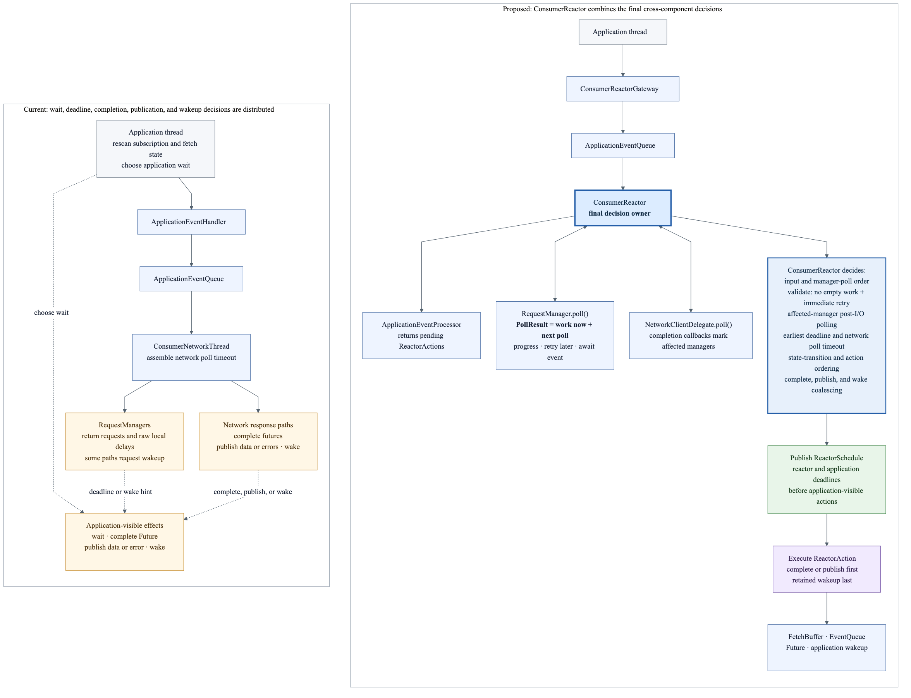
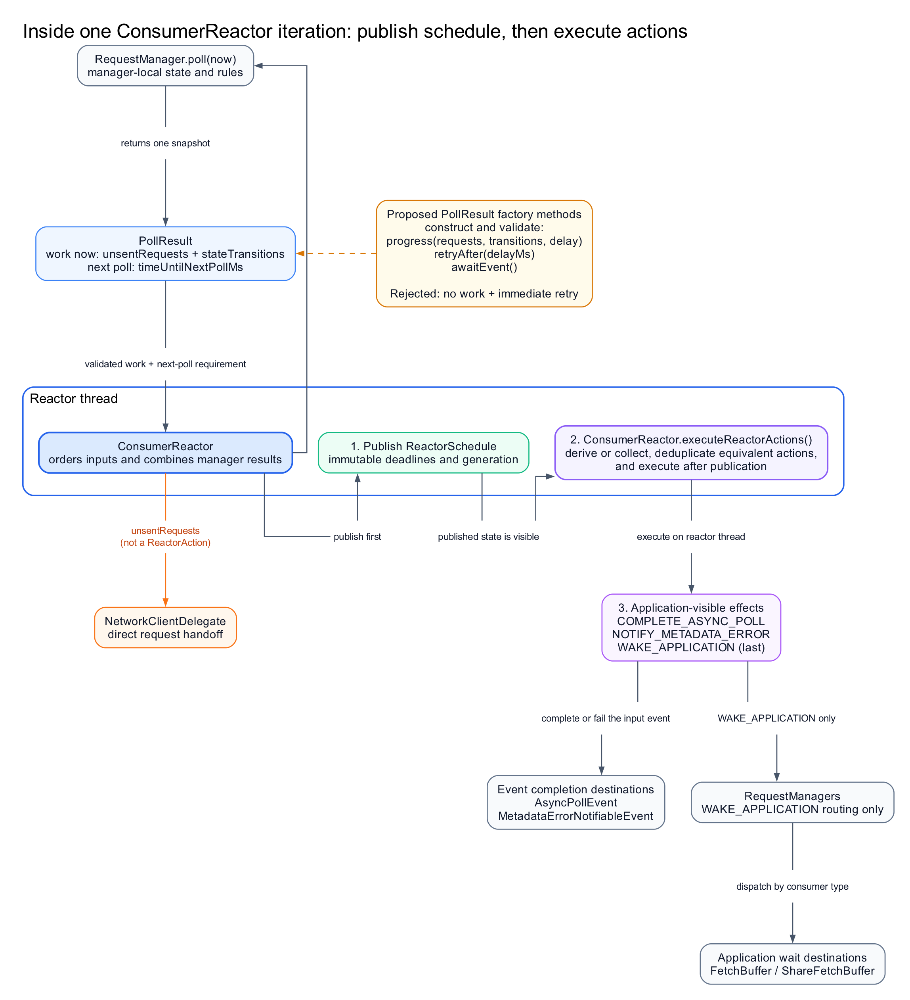

<!--
 Licensed to the Apache Software Foundation (ASF) under one or more
 contributor license agreements.  See the NOTICE file distributed with
 this work for additional information regarding copyright ownership.
 The ASF licenses this file to You under the Apache License, Version 2.0
 (the "License"); you may not use this file except in compliance with
 the License.  You may obtain a copy of the License at

    http://www.apache.org/licenses/LICENSE-2.0

 Unless required by applicable law or agreed to in writing, software
 distributed under the License is distributed on an "AS IS" BASIS,
 WITHOUT WARRANTIES OR CONDITIONS OF ANY KIND, either express or implied.
 See the License for the specific language governing permissions and
 limitations under the License.
-->

# KIP-1371: Introduce a Consumer Reactor for State Management and Event Processing

## Status

Current state: Draft

Discussion thread: TBD

Jira: TBD

## Summary

The regular consumer and share consumer already use a background event loop, request managers, network I/O, event
queues, futures, and data buffers. However, cross-manager scheduling and application-visible notification decisions
are still made on separate paths that may observe different state snapshots. This has contributed to busy loops,
lost or duplicate wakeups, stale completion handling, and state-publication races.

This proposal establishes `ConsumerReactor` as the final owner of input ordering, cross-manager scheduling, and
application-visible actions. Request managers retain their local state and rules and return requests, completed state
transitions, and `timeUntilNextPollMs` from one `poll()` snapshot. Each manager also determines whether polling it now
can make progress, must wait for a finite retry delay, or must wait for another event. The reactor combines those
already-valid results into one published `ReactorSchedule` and executes `ReactorAction` values only after the
corresponding state and schedule are visible.

The proposal does not add a thread, replace the existing event-driven topology, change Kafka protocols or public
consumer APIs, or move user callbacks off the application thread. The same thin reactor kernel is used by the regular
and share consumers, while their rules remain in separate components. `ClassicKafkaConsumer` is not retrofitted into
this model.

## Motivation

A local deadline can be urgent even when the Consumer as a whole cannot make progress. Today, no single component
combines those facts before selecting the next wait or application-visible action.

### A motivating failure: urgent work without progress

[KAFKA-20253 / PR 22836](https://github.com/apache/kafka/pull/22836) fixed a high-CPU loop after failed
re-authentication. Once the coordinator became unavailable, a heartbeat could be due but could not be sent. At the
same time, coordinator discovery or auto-commit could already be in flight. Two zero-delay paths were enough to spin
the application and background threads, and auto-commit had the same missing check for whether it could make
progress:

| Component | Local observation | Local result | Global reality |
| --- | --- | --- | --- |
| Heartbeat request manager | The heartbeat deadline had expired and no heartbeat was in flight. | Application wait `0`. | No coordinator existed, so no heartbeat request could be created. |
| Coordinator request manager | The retry backoff had elapsed. | Network poll delay `0`. | A `FindCoordinator` request was already in flight, so another request could not be created. |
| Auto-commit state | The commit interval had elapsed. | Application wait `0`. | A previous commit was still in flight, so another commit could not start. |

The application thread repeatedly observed a zero wait, while the background thread repeatedly called
`NetworkClient.poll(0)`. Both threads ran, but neither could change the state required for progress.

PR 22836 correctly added guards that check whether the affected path can make progress now by producing a request or
completed state transition. This fixed the bug, but it also demonstrates the maintenance problem: the result type did
not distinguish "retry now" from "nothing can change until another event." Diagnosing the failure required
correlating manager timers, in-flight state, the cached application wait, and the network poll timeout.

### Bug evidence

KAFKA-20253 is one instance of a recurring failure pattern. The affected features differ, but each case involved
decisions made on separate paths that could observe different snapshots of consumer state.

| Evidence | Observed failure | Decisions split across paths |
| --- | --- | --- |
| [KAFKA-17066 / PR 16885](https://github.com/apache/kafka/pull/16885), [KAFKA-17674 / PR 17342](https://github.com/apache/kafka/pull/17342) | An older position-initialization completion could affect a partition added while its request was in flight. | Assignment changes, the captured partition scope, and completion handling. |
| [KAFKA-18641 / PR 18737](https://github.com/apache/kafka/pull/18737), [KAFKA-15529 / PR 21476](https://github.com/apache/kafka/pull/21476) | Position and consumed-state publication could race with commit or application observation. | State mutation, publication, and dependent observation. |
| [KAFKA-20426 / PR 22018](https://github.com/apache/kafka/pull/22018), [KAFKA-20253 / PR 22836](https://github.com/apache/kafka/pull/22836) | Heartbeat urgency produced a zero wait while coordinator, assignment, or in-flight state made progress impossible. | Manager deadlines, progress blockers, application waiting, and network polling. |
| [KAFKA-20854 / PR 23014](https://github.com/apache/kafka/pull/23014) | An ambiguous empty fetch result caused application/background wakeup ping-pong. | Fetch result classification, application waiting, and synthetic wakeup. |
| [KAFKA-20397 / PR 21991](https://github.com/apache/kafka/pull/21991) | Metadata-error publication raced with an application thread entering its fetch-buffer wait. | Error publication, retained notification, and wait entry. |
| [KAFKA-18160 / PR 18089](https://github.com/apache/kafka/pull/18089) | Wakeup or interruption could skip callback acknowledgement. | Interruption, callback completion, and lifecycle handling. |
| [KAFKA-19357 / PR 19914](https://github.com/apache/kafka/pull/19914), [KAFKA-18569 / PR 18590](https://github.com/apache/kafka/pull/18590) | During close, coordinator discovery could stop while a pending commit still required it, or continue after commit and leave work no longer required it. | Pending-operation dependencies, coordinator discovery, and shutdown progress. |

These bugs establish the problem and the regression scenarios that the Test Plan must cover. The proposed ownership
model and mechanisms are introduced in Proposed Changes.

They do not establish synchronous request-manager invocation as the direct root cause of every failure. For example,
KAFKA-20253 was fixed by correcting heartbeat, commit, and coordinator progress and wait calculations; it did not
remove peer calls. The narrower claim is that cross-manager progress and lifecycle decisions were distributed, while
peer mutation calls made those dependencies implicit and allowed state to change outside the component publishing
the resulting schedule. This KIP makes the dependency, ordering, and state owner explicit rather than attributing
unrelated historical failures to one call mechanism.

## Public Interfaces

The initial migration changes no Kafka protocol, public `Consumer` or `ShareConsumer` API, callback execution
guarantee, runtime thread name, or existing metric name. `Consumer.wakeup()` retains its current user-visible
semantics. The coordination types described in Proposed Changes are internal. Any future public capacity
configuration or overload behavior requires a separately complete compatibility proposal.

## Proposed Changes

This KIP refactors the responsibilities of the existing `ConsumerNetworkThread` execution loop into
`ConsumerReactor`. The application/background thread topology and runtime thread name remain unchanged, while
`ConsumerReactor` becomes the final owner of cross-manager scheduling and application-facing effect ordering.
Specifically, it defines:

- the ordered phase in which application inputs and cross-manager `ManagerEvent` values are applied;
- the stable manager pass whose results form one published `ReactorSchedule`;
- the state-ownership boundary through which managers observe immutable snapshots but do not mutate peer state; and
- the publish-before-action boundary for application-visible completion, publication, notification, and wakeup.

The complete model is easiest to understand as one request lifecycle. Consider a heartbeat request sent to the
consumer group's coordinator node currently published by `CoordinatorRequestManager`:

1. **Admit work from current truth.** The heartbeat manager reads
   `CoordinatorSnapshot(coordinator=node-1, version=7)`. It builds the request for `node-1` and captures version `7` as
   bounded context for that attempt.
2. **Report what happened.** The response says that the coordinator is unavailable. The heartbeat manager does not
   mutate `CoordinatorRequestManager`. The response callback records
   `ManagerEvent.CoordinatorUnavailableObserved(version=7, cause)` in its producer-local `PendingManagerEvents`.
   The post-I/O poll publishes it as an element of `PollResult.managerEvents()`. The same `PollResult` may also carry
   unsent requests, completed state transitions, and the manager's next-poll delay. `ManagerEvent` is intentionally
   qualified because the existing `ApplicationEvent` and `BackgroundEvent` types already describe cross-thread
   communication.
3. **Route the fact to one owner.** `ConsumerReactor` defers the event. At the start of the next iteration, before
   draining application events, it routes deferred `ManagerEvent` values through the selected `RequestManagers`
   composition to `CoordinatorRequestManager`. The coordinator owner interprets the observation and alone decides
   whether it permits a mutation. The concrete path is:

   ```text
   PendingManagerEvents
     -> PollResult.managerEvents()
     -> ConsumerReactor.stagePollResult(...)
     -> ConsumerReactor.deferredManagerEvents
     -> RequestManagers.routeManagerEvents(...)
     -> CoordinatorRequestManager.handleCoordinatorUnavailableObserved(...)
   ```

   These names describe successive phases rather than synonyms: `pending` is producer-local before publication;
   `stagePollResult(...)` accepts the complete manager result; and `deferred` means the reactor has accepted the event
   but intentionally routes it at the beginning of the next iteration.
4. **Fence stale work.** `CoordinatorRequestManager` compares the observed version with its current snapshot. It
   applies version `7` only if version `7` is still current. If rediscovery has already published version `9`, the
   older observation is ignored and cannot invalidate the newer coordinator.
5. **Re-evaluate all managers.** `ConsumerReactor` runs the stable manager pass. Each manager returns one `PollResult`
   describing work available now and its next local poll requirement. The coordinator may propose a
   `FindCoordinator` request, while heartbeat and commit may wait for its completion. Unsent requests are staged with
   `NetworkClientDelegate`; no network I/O occurs yet, and requests are not `ReactorAction` values.
6. **Publish the next state-reflecting wait.** `ConsumerReactor` combines the retained manager deadlines into one
   immutable `ReactorSchedule` and publishes it. The schedule answers when processing must resume and how long the
   next network poll may block. The response iteration may already have published a post-I/O schedule before the
   event was deferred; this publication reflects the next iteration after owner routing and the full manager pass.
7. **Execute phase-visible effects after publication.** `ConsumerReactor` executes any pre-I/O `ReactorAction`, then
   calls `NetworkClientDelegate.poll()` using the published timeout. A network completion starts the post-I/O owner
   poll, schedule-publication, and action phase. Actions include async-poll progress or completion, metadata-error
   notification, and application wakeup; `WAKE_APPLICATION` executes last among actions in its phase. A phase which
   only changes coordinator state may publish a new schedule without producing an application-visible action.

The concepts in that lifecycle answer different questions:

| Concept | Question answered |
| --- | --- |
| `ManagerEvent` | What immutable fact has already occurred? |
| Snapshot | What versioned truth may new work use? |
| `PollResult` | What work did one manager make available, and when should it be polled again? |
| `ReactorSchedule` | When must the reactor run again, and how long may network polling block? |
| `ReactorAction` | What application-visible effect may execute after publication? |

The current POC implements the coordinator lifecycle above. Additional event families, owner snapshots, and
peer-mutation migrations remain Phase 2 work.

The design relies on three invariants:

1. Each mutable state has one execution-context owner. In the target design, request managers own their local state;
   peers may observe immutable snapshots or `ManagerEvent` values but may not mutate that state. `ConsumerReactor`
   owns the final cross-manager schedule and actions.
2. Every synthetic wakeup or reschedule names a real state transition, positive deadline, completion, application
   command, or capacity change. An empty manager result cannot request an immediate retry.
3. State and the resulting `ReactorSchedule` are published before completing futures, publishing data or events, or
   waking the application.

The goals are to centralize cross-manager ordering, scheduling, and synthetic notification decisions without moving
manager-local state or regular/share consumer rules into the reactor; derive application waits and network poll
bounds from one published schedule; preserve callback isolation and existing public behavior; and migrate
incrementally with deterministic correctness and performance evidence.

This KIP does not change the number or placement of application and background threads, combine regular and share
consumer state machines, move user callbacks onto the reactor thread, retrofit `ClassicKafkaConsumer`, rewrite every
request manager in one patch, or define new public queue-capacity and overload configuration.

The following sections define how this model is applied within the existing consumer implementation.

### 1. Define the responsibility boundary

Today, `AsyncKafkaConsumer` and `ShareConsumerImpl` each create a background execution context. They reuse the same
event-loop and network infrastructure, but state, wait, completion, publication, and wakeup decisions can still be
made by different components along the path. The proposal changes responsibility, not topology:



The existing application/background thread boundary remains. The final decisions transferred to `ConsumerReactor`
are:

- the order in which input events and request managers are processed, including which managers are polled again
  after network completion and when the next full ordered pass observes cross-manager state;
- the earliest retained manager deadline, the resulting network poll timeout, and the application wait projection;
- the ordering of completed state transitions and the `ReactorAction` values they require; and
- publication of `ReactorSchedule` before completing futures, publishing data or errors, or issuing a retained
  application wakeup. The target combines equivalent wake reasons once per complete iteration; the current POC does
  so separately at each action-execution phase.

Request managers continue to own their local state and rules. `NetworkClientDelegate` retains transport and
correlation responsibilities, and user callbacks remain on the application thread.

`ConsumerReactorGateway` describes the application-side submit, submit-and-wait, wake, schedule-read, and close
boundary. It replaces the less precise `ApplicationEventHandler` name without changing runtime thread names or
behavior.

| Component | Target responsibility after the KIP |
| --- | --- |
| `ConsumerReactor` | Order inputs, invoke managers, validate the generic no-progress invariant, retain their scheduling contributions, publish the final schedule, then collect, deduplicate equivalent actions, and execute `ReactorAction` values. |
| `RequestManagers` composition | Select the regular or share manager set and route `ManagerEvent` values to one state owner without introducing a dynamic dependency graph. |
| Request manager | Own one domain of mutable consumer state and the conditions required to make progress; when another manager needs a coherent cross-manager view, optionally publish a small immutable projection for that reader; consume only `ManagerEvent` values addressed to it; and return progress, a positive finite retry delay, or an event wait from its local poll state. |
| Proposed `RegularConsumerDriver` / `ShareConsumerDriver` | Keep assignment or acquisition, commit or acknowledgement, and callback coordination outside the shared reactor loop. These types do not yet exist in the codebase. |
| `NetworkClientDelegate` | Own transport, connection handling, request correlation, and timeouts; do not decide whether to complete an application event or wake the application thread. |
| Application thread | Execute user callbacks and consume published data, events, and operation results. |

The reactor coordinates these owners; it does not absorb their local rules or transport mechanics.

The following diagram expands one reactor iteration. `ConsumerReactor` publishes the schedule and then executes
application-facing actions. Network requests remain a direct handoff to `NetworkClientDelegate` and are not
`ReactorAction` values. The strengthened manager result is summarized as `PollResult = work now + next poll`; its
proposed factory methods and valid field combinations are defined in the next section.



### 2. Define the processing model

An input event is an existing application command, network completion, deadline expiry, capacity release, or callback
acknowledgement. It is a semantic term, not a requirement to add another queue: application commands use the existing
`ApplicationEventQueue`, while network completions occur directly during `NetworkClientDelegate.poll()` on the
reactor thread.

Input events are not merged into one state mutation. The reactor applies them in a deterministic order, then polls
the affected managers and aggregates their scheduling results. The target model combines semantically equivalent
external actions, such as multiple synthetic wake reasons in one complete reactor iteration. Requests, callbacks,
and terminal operation results retain their identities and ordering. Combining wake reasons means that several
equivalent reasons execute one primitive wakeup while all reasons remain observable.

For example, if an assignment adds `tp2` before an older `OffsetFetch(scope={tp1})` completes, the assignment event is
applied first and the older completion can update only `tp1`. A later ordered position operation initializes `tp2`.

The target reactor iteration is:

1. Route typed `ManagerEvent` values retained from the previous post-I/O phase to their state owners through the selected
   regular or share composition.
2. Drain ready application commands and callback acknowledgements and apply them through the same composition.
3. Capture the current references to any opt-in owner-published snapshots used by new cross-manager work in this
   ordered pass.
4. Poll the stable manager set in order and collect their `PollResult` values.
5. Retain per-manager deadlines, form one `ReactorSchedule`, and publish it.
6. Execute pre-I/O actions derived from completed transitions.
7. Poll network I/O no longer than the published deadline.
8. Re-poll each completion's owning manager, publish the updated schedule, execute post-I/O actions, and retain any
   typed `ManagerEvent` values for the next full ordered pass.

Under the target rule, managers do not call one another recursively and do not invoke peer mutation methods. A
completion marks its owning manager and may return a typed immutable fact. The composition routes that fact to the
single state owner before the next full ordered pass. Because network I/O has already occurred when the fact is
produced, dependent work cannot be sent until the next reactor iteration. The reactor therefore relies on the next
stable full manager pass rather than embedding hard-coded manager-to-manager routing, fixed-point traversal, or a
central dependency graph. The current POC applies this rule to coordinator invalidation; membership and offsets peer
interactions remain explicit migration targets rather than claimed completed coverage.

#### Owner-published snapshots and stale-observation fencing

A snapshot is an opt-in cross-manager state view, not a required output of every `RequestManager`. A state owner
publishes a small immutable snapshot only when another manager needs a coherent set of decision-relevant fields.
Fields which must be observed atomically, such as coordinator target and coordinator version, belong to the same
snapshot. Snapshot versions are owner-local internal identities; they are not Kafka protocol `generationId` or
`memberEpoch` values. The owner increments the version only when published decision-relevant truth changes, not for
every poll, log, or metric update.

An admitted request captures the snapshot version and only the bounded target or scope required for that attempt. An
old snapshot may therefore remain as captured context for an in-flight request, but it cannot be used to admit new
work. The coordinator example follows the complete fencing path:

```text
read current CoordinatorSnapshot(READY, node-1, version=7)
  -> build the heartbeat request and capture target=node-1, observedVersion=7
  -> the response produces CoordinatorUnavailableObserved(observedVersion=7, cause)
  -> PendingManagerEvents retains the greatest observedCoordinatorVersion for this event type
  -> the event is published in PollResult and routed to CoordinatorRequestManager
  -> the owner compares observedVersion with its current CoordinatorSnapshot version
  -> apply only if the versions still match; otherwise ignore the stale observation
```

If several coordinator-unavailable responses arrive before publication, `PendingManagerEvents` prevents its
producer-local slot from moving to a lower observed coordinator version. That buffer rule does not decide whether an
observation is current: after routing, `CoordinatorRequestManager` performs the final comparison against the
owner's current version. Each producer retains at most one pending fact of each bounded type until its next
`PollResult`, and the reactor retains only those bounded facts until the next routing phase.

The current POC implements only `CoordinatorSnapshot`. It has no global snapshot registry and retains no snapshot
history. `CoordinatorRequestManager` owns the current snapshot; a coordinator-dependent request retains only its
captured target, version, and bounded request context. `ReactorSchedule` is a separate aggregate scheduling
publication, not a registry of manager domain state. Additional opt-in owner snapshots remain later migration work.

#### Manager poll outcomes and `PollResult`

A manager poll outcome answers one narrow question: if the reactor polls this manager now, can the manager produce a
request or completed transition? This is not a second deadline and `ConsumerReactor` does not determine the answer.
The manager already owns the required state, such as coordinator availability, request-in-flight state, retry
backoff, metadata availability, or buffer capacity.

Each manager poll returns one `PollResult` containing four pieces of information in the target model:

- `unsentRequests`: requests ready for the reactor to hand to `NetworkClientDelegate`;
- `stateTransitions`: completed manager changes ready for the reactor to apply;
- typed `ManagerEvent` values selected for composition routing; and
- `timeUntilNextPollMs`: how long the reactor may wait before polling that manager again.

The factories give names and validation to the meaningful combinations of these existing fields; they do not
introduce three new kinds of state. They are implemented in the current POC while legacy constructors remain for
incremental migration:

```java
PollResult.progress(unsentRequests, stateTransitions, managerEvents, timeUntilNextPollMs);
PollResult.retryAfter(delayMs);
PollResult.awaitEvent();
```

| Manager result | Immediate output | Scheduling meaning |
| --- | --- | --- |
| `progress(requests, transitions, managerEvents, delay)` | At least one request, transition, or typed `ManagerEvent` | Consume the output now; `delay` describes the next manager poll after that state change. |
| `retryAfter(delayMs)` | None | Poll this manager again after a positive, finite manager-local delay. |
| `awaitEvent()` | None | Do not schedule a periodic manager poll; poll it after a relevant input event. |

The factories are the target internal API and are present in the current POC. Existing constructors remain compatibility adapters while managers are
migrated. Without this validation, a manager can return a contradictory result:

```text
PollResult
  unsentRequests      = []   // there is no request to send
  stateTransitions    = []   // there is no completed change to apply
  timeUntilNextPollMs = 0    // nevertheless, poll this manager again immediately
```

The first two fields say that this iteration made no progress, while the third asks for an immediate retry. Repeating
the same result can spin the reactor without changing any state. The generic invariant is therefore that an empty
result cannot request an immediate retry. The reactor does not decide whether manager-specific work can make progress;
the manager selects the correct result from its own state. A manager returning `progress(...)` must also consume or
latch the reported request or transition so that its next poll cannot emit the same logical progress again.

`awaitEvent()` has no duration. It may use `Long.MAX_VALUE` as an internal representation, but the reactor still wakes
for admitted application events, network completions, cancellation, and shutdown. The existing bounded network poll
remains an implementation safeguard; it is not the semantic retry interval for an event wait.

Examples across managers are shown below. Related evidence names the historical issue when the state directly models
that regression. Control and general cases demonstrate the same result invariant but are not claimed as separate
historical bugs.

| Manager state | Result | Related evidence |
| --- | --- | --- |
| Heartbeat is due but coordinator discovery is in flight | `awaitEvent()`; the discovery completion is the enabling event. | [KAFKA-20253 / PR 22836](https://github.com/apache/kafka/pull/22836) |
| Heartbeat is due and can be constructed | `progress([heartbeatRequest], [], heartbeatIntervalMs)` and record the request as in flight. | Control case for KAFKA-20253 |
| Auto-commit is due but an earlier commit is in flight | `awaitEvent()`; do not return an empty zero-delay result. | [KAFKA-20253 / PR 22836](https://github.com/apache/kafka/pull/22836) |
| Coordinator retry backoff has 75 ms remaining | `retryAfter(75)` | General finite-retry case |
| Fetch preparation finds data already buffered | `progress([], [FETCH_BUFFER_HAS_DATA], WAIT_FOREVER)` | [KAFKA-20854 / PR 23014](https://github.com/apache/kafka/pull/23014) |
| Fetch request is in flight | `awaitEvent()` | KAFKA-20854 control case |
| Topic-metadata request is in retry backoff | `retryAfter(remainingBackoffMs)` | General finite-retry case |
| Share acknowledgement request is in flight | `awaitEvent()` | General share-consumer case |
| Membership manager is waiting for a callback acknowledgement | `awaitEvent()` | [KAFKA-18160 / PR 18089](https://github.com/apache/kafka/pull/18089) |

Strict factories validate only the generic shape. While legacy constructors remain, the current reactor check is a
Java assertion and therefore a test/debug diagnostic rather than a production hard guard. Neither mechanism knows why
a heartbeat, commit, fetch, coordinator, or share acknowledgement can or cannot make progress. This preserves the
ownership boundary while making immediate no-progress loops a directly testable invariant violation.

### 3. Preserve operation identity and shared dependencies

Input events, application-visible operations, scheduling decisions, actions, and network attempts are not
interchangeable. The target model distinguishes the smallest identity required at each layer; some rows are existing
objects while others state a required invariant without mandating a new type:

| Identity | Purpose |
| --- | --- |
| Input sequence | Orders events accepted by the reactor and supports causal tracing. |
| Operation identity | Tracks one admitted application API operation until exactly one terminal result. It lets the reactor associate later retries and completions with the correct future, and reject a late or duplicate completion after timeout, cancellation, or termination. It may be represented by the existing application event and future or by an explicit internal ID; it is not assigned once per `ReactorAction`. |
| Request attempt identity | Distinguishes network attempts and retries within an operation; transport correlation remains in `NetworkClientDelegate`. |
| Owner snapshot version and scope | Prevents an older completion from mutating newer owner state or partitions outside the operation's captured scope. |
| Reactor publication generation | Identifies the immutable state-and-schedule publication observed by application-side readers. It is not a manager state version. |
| Protocol generation or member epoch | Retains broker-defined group identity and fencing semantics; it is not reused as an internal snapshot version. |

These concepts answer different questions:

- operation identity preserves which admitted API operation owns later retries and completions, so the correct future is
  completed exactly once and stale work cannot complete an operation that has already timed out, been cancelled, or
  terminated;
- `ReactorSchedule` answers when the reactor must run again and how long network polling may block; and
- `ReactorAction` answers which external effect the reactor executes after publishing that schedule.

One operation can span several schedule publications and network attempts before producing one terminal completion.
Conversely, one deduplicated wake action can notify the application about several progress reasons, so an action cannot
serve as the operation identity. The target ordering for `commitSync` encountering a coordinator change is a concrete
example:

```text
Application thread calls commitSync(offsets, timeout)
  -> one SyncCommitEvent and its future represent the pending commit operation

OffsetCommit attempt 1 returns NOT_COORDINATOR
  -> the commit operation remains pending
  -> CommitRequestManager reports CoordinatorUnavailableObserved with the request's coordinator version
  -> the next reactor iteration routes the fact to CoordinatorRequestManager
  -> CoordinatorRequestManager applies it only if that version is still current
  -> the full ordered pass schedules FindCoordinator without completing the commit

FindCoordinator response records the new coordinator
  -> the next full ordered pass lets commit and heartbeat observe the new coordinator snapshot
  -> OffsetCommit attempt 2 is sent for the same commit operation

OffsetCommit attempt 2 succeeds
  -> ConsumerReactor publishes the resulting schedule
  -> the terminal completion action completes the SyncCommitEvent future once
```

The two `OffsetCommit` attempts have separate transport correlation, but they do not become two application
operations. `FindCoordinator` is shared infrastructure work that may also unblock heartbeat, join, or other commit
work; it is not owned by the commit action. Pending operations remain in their existing managers rather than being
copied into an unbounded central dependency graph.

Stable operation identity is required so retry, cancellation, interruption, and close races cannot produce missing
or duplicate terminal completion. This KIP requires that stability and exactly-once terminal outcome, but does not
require a new public ID or a new generic `OperationId` class when the existing event and future already provide the
necessary identity. These identities do not change Kafka protocol correlation IDs or public Consumer APIs.

### 4. Publish one schedule before executing actions

For every manager result, the reactor converts `timeUntilNextPollMs` into an absolute deadline and retains that
manager's contribution. `ReactorSchedule` selects the earliest retained deadline. Updating one manager cannot erase
an earlier deadline from another manager, and an unrelated early network return cannot postpone existing work.

This absolute value is the reactor deadline, not a promise of network I/O. It means the reactor must poll the manager
again by that time; reconnect backoff, metadata, capacity, callback, or local-state progress may be the reason. The
reactor derives `networkPollTimeoutMs(now)` from the remaining reactor deadline only when it calls the existing
network client.

The published schedule satisfies these properties:

- the same published `ReactorSchedule` exposes the network-poll and application-wait projections;
- a newly shorter deadline is visible before releasing a waiter using an older snapshot;
- an expired deadline is consumed by polling its manager again, not by repeatedly waking the application;
- an event-only wait does not create periodic wakeups.

`ReactorAction` represents an application-visible effect selected after state and schedule publication. The current
implementation covers application wakeup and async-poll progress or completion. Later migration may generalize these
into operation completion, application publication, and application notification. Network requests remain manager
outputs, retry remains a schedule deadline, and state transitions remain internal; they are not `ReactorAction`
values.

The target combines equivalent wake actions across one complete reactor iteration into one primitive wakeup while
their reasons remain observable. Terminal operation completions are never merged. Wakeup executes last so the
application thread observes the state, schedule, data, event, or completion that caused it. The current POC combines
actions separately at each pre-I/O, post-I/O, and final-drain execution point, so one iteration may still issue more
than one primitive wakeup. This is a migration gap, not the target behavior.

The ordering invariant is:

> Apply transitions, publish the resulting state and `ReactorSchedule`, then execute `ReactorAction` values.

The same causal chain must also be diagnosable without formatting collections on a disabled hot-path log. The target
diagnostic contract adds the schedule generation and deadline source to TRACE records, the action reason and
destination to action records, and metrics for primitive application wake count and consecutive zero-timeout
iterations. On diagnostic demand, the bounded `ManagerPollCache` exposes the current per-manager result and retained
deadline snapshot; it does not retain an unbounded history. These observability additions are migration work and are
not claimed as current POC coverage.

### 5. Share the reactor kernel, not consumer rules

The regular consumer and share consumer use separate reactor instances but the same execution kernel because they
share the same concurrency topology. Their rules remain separate. `RegularConsumerDriver` and
`ShareConsumerDriver` are proposed internal boundaries; they do not yet exist in the codebase:

| Component | State and behavior retained outside the reactor |
| --- | --- |
| Proposed `RegularConsumerDriver` | assignment, positions, offset fetch/commit, membership, rebalance transitions, and regular fetch behavior |
| Proposed `ShareConsumerDriver` | share membership, acquisition, lock renewal/release, acknowledgement, and share fetch behavior |

The shared reactor must not branch on consumer type. An `isShareConsumer` switch or a regular/share union in the
reactor loop indicates that consumer-specific behavior has leaked across the boundary.

### 6. Example: reconnect backoff with another manager deadline

Assume the fetch manager is blocked by a reconnect backoff that expires in 100 ms while the heartbeat manager must be
polled in 50 ms:

```text
FetchRequestManager.poll()
  -> requests=[]
  -> transitions=[]
  -> timeUntilNextPollMs=100

HeartbeatRequestManager.poll()
  -> timeUntilNextPollMs=50

ConsumerReactor
  -> publishes ReactorSchedule(deadline=heartbeat at 50 ms)
  -> no application wakeup
```

At 50 ms, the reactor polls heartbeat work. The retained fetch deadline remains at 100 ms even if heartbeat network
I/O returns early. At 100 ms, the reactor polls the fetch manager again and creates the fetch request from its retained
intent. Backoff and in-flight states do not wake the application because they do not represent application-visible
progress.

When data becomes available, the reactor publishes the corresponding state and schedule before the data/completion
action and any deduplicated application wakeup. This single flow covers the two central requirements: cross-manager
deadlines cannot hide one another, and only real progress notifies the application.

## Compatibility, Deprecation, and Migration Plan

### Phase 1: Establish the decision boundary

- Establish the existing background loop as `ConsumerReactor` without changing thread topology.
- Publish one `ReactorSchedule` and execute actions only after publication.
- Add compatibility-safe `PollResult.progress(...)`, `retryAfter(...)`, and `awaitEvent()` factories. Strict factories
  reject contradictory shapes. While legacy constructors remain, a reactor assertion identifies an empty zero-delay
  result by manager in tests; add a production diagnostic counter for the same violation before relying on the
  invariant outside assertion-enabled runs.
- Migrate fetch reconnect, in-flight, paused, missing-leader, and buffered-data decisions to the strengthened
  `PollResult`.

Exit evidence: reconnect-backoff, schedule aggregation, publish-before-wakeup, and busy-loop tests pass with no public
API change.

### Phase 2: Migrate manager and consumer-specific decisions

- Move remaining manager deadlines and completed transitions into `PollResult`.
- Replace peer mutation calls with typed immutable `ManagerEvent` values routed through the selected composition to one state owner.
- Where a manager needs a coherent cross-manager view, publish a small opt-in owner-local snapshot and fence delayed
  observations with the captured snapshot version.
- Introduce the regular/share driver boundary around the existing managers and remove consumer-type decisions from
  the shared reactor loop.
- Remove hard-coded coordinator dependency branches from `ConsumerReactor`; the next stable full manager pass observes
  cross-manager changes before the next network poll without a central dependency graph.
- Replace application-side mutable-state rescans with immutable schedule or operation results after equivalent tests
  exist.

Exit evidence: multi-manager, stale-completion, regular-consumer, and share-consumer suites pass independently.

### Phase 3: Remove remaining direct application effects

- Route remaining operation completions, data/event publication, callback requirements, and synthetic wakeups through
  the publish-before-action boundary.
- Combine equivalent wake actions across the complete reactor iteration, not separately at each execution phase.
- Remove direct application completion and wakeup decisions from `NetworkClientDelegate` while retaining transport
  correlation locally.
- Drain already selected actions during close before queues, buffers, and pending-operation resources are closed.
- Remove compatibility adapters only after every success, error, timeout, cancellation, interruption, and close path
  has a terminal result.

Exit evidence: no manager or transport callback directly selects an application wake/error path, and every admitted
operation completes once.

Each phase leaves the repository runnable and can be reverted independently.

## Test Plan

Tests assert observable event-processing behavior rather than private method coverage. Required coverage includes:

- reconnect backoff creates no request or wake before its deadline and creates the request when the deadline expires;
- an earlier heartbeat or commit deadline cannot erase or postpone a retained fetch deadline;
- schedule publication occurs before pre-I/O and post-I/O actions;
- repeated no-progress manager results do not produce a zero-timeout loop or wakeup ping-pong;
- an empty zero-delay `PollResult` is rejected, while finite retries and event waits produce the intended schedule;
- one complete reactor iteration combines equivalent wake reasons into at most one primitive synthetic wakeup;
- heartbeat, auto-commit, fetch, coordinator, metadata, and share-acknowledgement tests distinguish progress,
  finite retry, and event-wait states without moving their local rules into the reactor;
- a coordinator completion makes dependent work visible in the next ordered pass, and any resulting request is sent
  by the following network poll without a hard-coded same-phase manager branch;
- a request target and its owner version come from one immutable snapshot;
- an observation captured from an older coordinator version cannot invalidate a later coordinator, while an
  observation matching the current version is applied;
- every manager consuming an opt-in owner-published view in one ordered pass uses the same captured snapshot version;
- pending `ManagerEvent` values remain latest-only and bounded, the owner retains only its current published snapshot,
  and in-flight work retains a version and bounded scope rather than snapshot history;
- no request manager directly invokes another request manager's mutation API;
- an older offset-fetch completion cannot mutate a partition outside its captured scope;
- regular and share paths use the same kernel without consumer-type branches;
- callback, interruption, cancellation, and close produce exactly one terminal outcome, including an async-poll
  completion selected immediately before close;
- broker stop/restart and coordinator loss make progress without application polling as a scheduler.

Each issue cited in Motivation requires a deterministic reproduction through the relevant production components. In
particular, `AsyncKafkaConsumerTest.testReactorPreservesNewPartitionAcrossOlderOffsetFetchCompletion` exercises the
real application-event, reactor, request-manager, `MockClient`, and subscription-state path for KAFKA-17066/17674.

Performance validation compares the proposed implementation with the immediately preceding async consumer under the
same group protocol, broker, workload, and client configuration. `ClassicKafkaConsumer` remains a secondary
historical reference for manual-assignment workloads. The required gates cover saturated throughput,
idle-to-first-record latency, idle CPU/wakeup rate, allocation per record, and reconnect recovery. A regression beyond
the predeclared threshold must be investigated before the corresponding migration phase is accepted. Detailed run
ordering, statistics, raw samples, commit ids, and Jenkins artifacts remain in the companion benchmark evidence
rather than this KIP.

## Documentation Plan

Contributor documentation will describe the reactor, driver, and manager ownership boundary, schedule and action
ordering, and the evidence required before each compatibility path is removed. Public migration documentation is
unnecessary unless a later proposal adds capacity configuration, overload behavior, or observable name changes.

## Rejected Alternatives

### Keep distributed decisions with local fixes

Local timeout conditions, application-side rescans, and generic wakeup booleans can address individual failures but
retain multiple decision authorities. They cannot consistently preserve reason and publication ordering.

### Let the reactor infer whether a manager can make progress from a raw delay

A raw zero delay is ambiguous: it can mean executable work is ready, or that a local timer is overdue while another
condition still prevents progress. Making the reactor interpret heartbeat, commit, fetch, metadata, and share
acknowledgement state would duplicate manager rules in the shared kernel. The constrained `PollResult` shapes instead
require each manager to classify its own result and let the reactor validate only the generic no-progress invariant.

### Put all consumer logic in one reactor class

This centralizes code rather than decisions and would mix regular/share behavior into the execution kernel. Managers
and drivers keep their rules local while the reactor remains the final coordination owner.

### Implement separate regular and share reactor stacks

Duplicating queue drain, scheduling, publication, shutdown, and action ordering invites different concurrency bugs.
The consumers share the kernel but not their state machines.

### Migrate all managers in one patch

An all-at-once rewrite removes comparison seams and makes regressions difficult to localize. The phased approach
keeps each slice runnable and independently testable.

### Traverse a dynamic manager dependency graph

The manager set is small and fixed for one consumer instance. A stable full ordered pass before each network poll is
the correctness baseline and has `O(active managers)` cost. If measurement later justifies incremental polling, the
composition may own a static fact-type-to-manager index and poll a stable dirty set. Recursive polling, fixed-point
evaluation, and a dynamic dependency DAG are non-goals.

## Related Work

- [KAFKA-14246](https://issues.apache.org/jira/browse/KAFKA-14246) and the
  [consumer threading refactor design](https://cwiki.apache.org/confluence/spaces/KAFKA/pages/217393224/Consumer+threading+refactor+design)
  deliberately introduced an event-driven communication boundary between the application and network threads. That
  design did not attempt to model all same-thread request-manager coordination as events, so cross-manager progress,
  lifecycle, scheduling, and application-visible effect decisions could remain distributed across managers and
  completion paths. This KIP builds on that topology by defining `ConsumerReactor` as the background-thread
  orchestrator and by making cross-manager ordering, state ownership, schedule publication, and action ordering
  explicit; it does not reject or replace the original refactor.
- [KIP-945](https://cwiki.apache.org/confluence/display/KAFKA/KIP-945%3A%2BUpdate%2Bthreading%2Bmodel%2Bfor%2BConsumer)
  is a WIP proposal documenting the broader threading-model intent. It remains related history, not this KIP's
  baseline or a prerequisite.
- [KAFKA-20854 / PR #23014](https://github.com/apache/kafka/pull/23014) narrows one busy-loop cause. This proposal uses
  the same problem decomposition and generalizes the scheduling and action boundary across managers.
