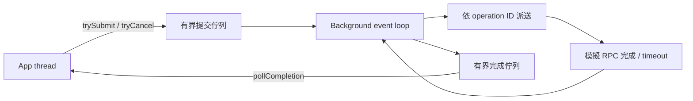

# App／background 雙佇列原型

**已完成可執行、兩個執行緒的提交／完成契約原型。100,000 筆操作、2,000 次取消競爭與 100 次指定休眠競爭通過。未接入 Kafka broker，也沒有新的效能數字。**

## 架構



兩條佇列皆為 SPSC（單一 producer、單一 consumer）ring。App 是唯一提交者與結果消費者；background 是唯一 operation 狀態及 timer 擁有者。沒有掃描 Request Managers；完成／取消依 operation ID 定位。

此版本獨立於既有 consumer 原型，不載入 Kafka classes、沒有 JNI／native io_uring、沒有第三個 RPC worker。模擬 RPC 回覆由 background 的有序 timer 容器交付，並不等於已整合真實網路 readiness。

## 容量契約：先保留完成位置

每次成功提交，app 先承擔一份 completion credit；讀走該 operation 的唯一 terminal completion 後，credit 才釋放。因此：

`accepted but not consumed = queued + active + completed but unread <= CQ capacity`

已接受的操作都保有完成位置。若 CQ 已完全塞滿，所有 credit 都對應未讀結果，依 invariant 不會另有尚未完成的 accepted operation。新提交回傳 -1，不阻塞，也不建立無界 overflow list。

測試包含 CQ 接近滿時最後一筆 timeout 完成，以及 CQ 全滿時 background shutdown。這能保證已接受的工作不因 app 暫停讀取而卡在 CQ 寫入。

代價：在途 request 上限與 CQ capacity 綁定，可能比可動態擴張的設計更早產生背壓。真實 fetch 還需要 byte／buffer 容量管理；僅限制 operation 數不能限制任意大小 payload 的記憶體用量。

## 非阻塞與喚醒

- trySubmit 立即接受或回報背壓／關閉。
- tryCancel 立即回報是否已排入取消指令；成功排入不代表取消一定勝過回覆。
- pollCompletion 立即回傳結果或 null。
- requestClose 立即發布關閉請求，background 把尚未完成的 accepted operations 完成為 CANCELLED。
- awaitCompletion 是選用的 app 等待 API；AutoCloseable.close 的 bounded join 是測試／清理便利方法，不是非阻塞提交 API。
- background 無事可做時休眠，timer 到期或新提交喚醒；不 busy-spin 等待 RPC。

背景休眠順序：宣告 sleeping → 重查 SQ／close／timer → park。提交者先發布 command，再根據 sleeping 狀態 unpark。若通知發生在 park 前，LockSupport permit 保留這次通知。整個睡眠窗口不可插入另一個會消耗 permit 的阻塞操作。

指定競爭測試最初使用 CountDownLatch.await 暫停這個窗口，會自行消耗正在驗證的 unpark permit。測試已改成只在測試 hook 使用短暫 yield 等待放行，production hook 是空操作；正常 event loop 不使用這個忙等。

將來接入 Selector 時，必須改用對應的 Selector.wakeup／阻塞協議並重跑競爭測試，不能假設 LockSupport.unpark 能喚醒 socket selector。

## 取消、期限與公平性

- operation 只可產生一次 terminal completion：OK、TIMEOUT 或 CANCELLED。
- timeout 與模擬回覆的期限完全相同時，TIMEOUT 優先。
- 晚到 cancel 不會完成第二次；取消移除該 operation 的回覆與 timeout 節點，避免累積無效 timer。
- SQ 預留一個 slot 給 control command。多個取消仍可能填滿佇列，此時 tryCancel 回傳 false，app 必須處理重試；沒有保證无限 control 容量。
- close 使用獨立旗標與同一喚醒機制，不會因 SQ 全滿而排不進去。
- 每輪最多處理 64 個 commands，再最多處理 64 個到期 timers，避免持續提交完全壓住 timer。
- shutdown 才枚舉 bounded active operations，平常依 ID／到期 timer 處理。

## 通過的測試

1. Ring full/empty/FIFO 與 10,000 次回繞。
2. 100 次確定讓 enqueue 位於「queue recheck 與 park 之間」的競爭，全部取得完成結果。
3. Data SQ 滿時的立即背壓、保留 cancellation slot、已在途與排隊工作的 shutdown cancellation。
4. App 暫停讀 CQ：最後一筆 timeout 能完成；CQ 全滿仍能關閉；之後結果全數可讀。
5. Timeout tie、成功後晚到取消、2,000 次 completion/cancel 競爭，以及 active/timer 容器最後為空。
6. 100,000 筆雙執行緒操作：ID 唯一、payload 正確、每笔成功結果恰好一次、credits 全部回收、閒置時有 park。

這些是有界正確性測試，不是 Java Memory Model 的形式證明或 jcstress 完整矩陣。未量測 deadline p99、吞吐量或 CPU，也不能據此宣稱 2×。

## 下一步

把已驗證的 coordinator／heartbeat 邏輯接到此 operation／completion 契約，將模擬 timer 回覆替換成真實 network callback，補上 socket readiness 與 application wakeup 的整合。先保持 request/state trace 等價，再比較舊雙執行緒協調成本。

buffer 所有權、streaming/multishot 結果、app 卡在使用者 callback、fatal background error 的對外契約，以及 overload 下的吞吐／尾延遲，仍需設計與驗證。目前原型傳遞固定大小 primitive payload，不代表 Kafka record buffer 已解決。

## 重跑

Repository 中：

```sh
/opt/homebrew/bin/python3 experiments/next-poll-condition/event-only/duplex/validate.py
```

以 Java 11 相容目標編譯，JDK 17 執行，128 MB heap，兩個有效 processors，45 秒總執行 timeout；不依賴 Kafka jar。Standalone bundle 亦可在解壓後執行：

```sh
javac --release 11 -d classes DuplexEngine.java DuplexTest.java
java -Xmx128m -cp classes org.apache.kafka.clients.consumer.internals.duplex.DuplexTest
```

Git production source 與歷史未改動。證據包包含原型、測試、runner、最終 log 與 SHA-256。git diff --check 通過；沒有執行完整 Kafka Gradle／Checkstyle。
