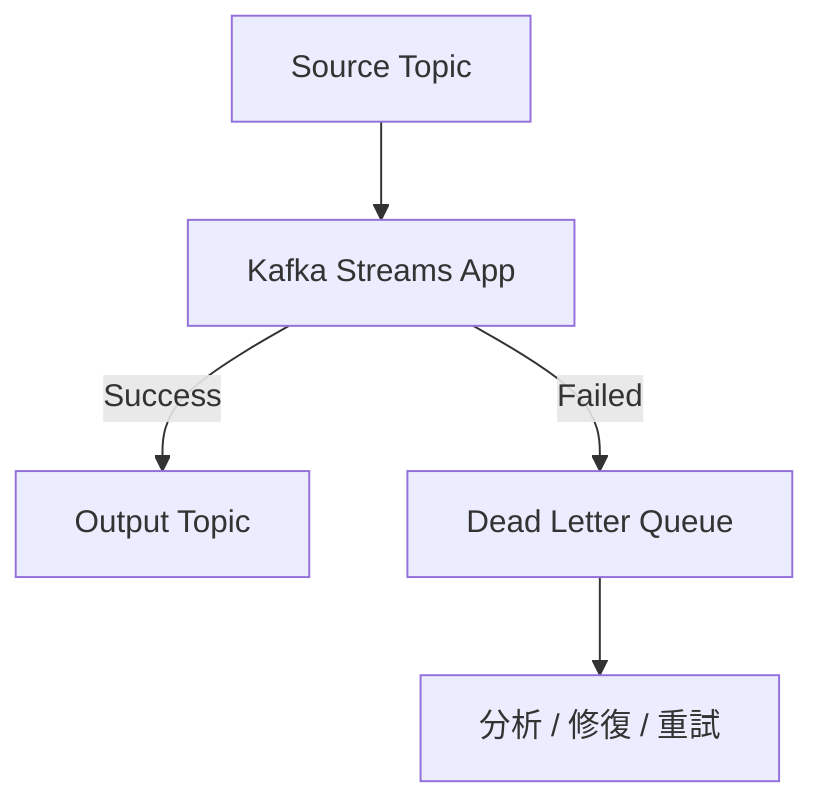
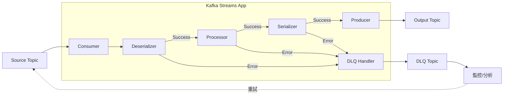

# 【訊息急診室】

## Kafka Streams DLQ：壞訊息不再讓你頭痛

<div class="pt-12">
  <span class="px-2 py-1 rounded cursor-pointer" hover="bg-white bg-opacity-10">
    KIP-1034 | Kafka Streams 4.2 新功能
  </span>
</div>

---
layout: default
---

# Agenda

<v-clicks>

1. **What is DLQ?** - Dead Letter Queue 是什麼
2. **Why DLQ?** - 為什麼需要 DLQ
3. **Before DLQ** - 過去的錯誤處理方式
4. **After DLQ** - KIP-1034 帶來的改變
5. **Basic Usage** - 基本用法
6. **Live Demo** - 實際演示

</v-clicks>

---
layout: center
class: text-center
---

# What is Dead Letter Queue?

---
layout: two-cols
---

# Dead Letter Queue (DLQ)

<v-clicks>

- 一個**特殊的 Topic**，用來存放無法處理的訊息
- 訊息處理失敗時，不丟棄也不停止
- 將「有問題的訊息」轉移到 DLQ
- 後續可以**分析、修復、重新處理**

</v-clicks>

::right::

<div class="pl-4">



</div>

---

# DLQ 整體架構圖



---
layout: center
class: text-center
---

# Why DLQ?

為什麼需要 Dead Letter Queue？

---

# 現實世界的問題

<v-clicks>

### 訊息處理可能失敗的原因：

- **Deserialization 失敗** - 無法解析訊息格式 (Poison Pill)
- **Processing 失敗** - 業務邏輯處理異常
- **Production 失敗** - 無法寫入下游 Topic

### 沒有 DLQ 時的困境：

- 🛑 **停止處理** - 一個壞訊息癱瘓整個應用
- 📝 **Log and Skip** - 訊息消失，難以追蹤
- 🔄 **無限重試** - 永遠卡在同一條訊息

</v-clicks>

---
layout: center
class: text-center
---

# Before DLQ

KIP-1034 之前的錯誤處理

---

# Before: 現有的 Exception Handlers

```java
// DeserializationExceptionHandler - 兩個選項
public enum DeserializationHandlerResponse {
    CONTINUE,  // Log and skip - 可能遺失訊息
    FAIL       // 停止整個應用 (預設)
}

// ProductionExceptionHandler - 三個選項
public enum ProductionExceptionHandlerResponse {
    CONTINUE,  // 忽略寫入失敗
    FAIL,      // 停止整個應用 (預設)
    RETRY      // 重試失敗的操作
}
```

<div class="text-xs text-gray-400 mt-2">

📎 [DeserializationExceptionHandler.java#L99-L119](https://github.com/apache/kafka/blob/trunk/streams/src/main/java/org/apache/kafka/streams/errors/DeserializationExceptionHandler.java#L99-L119) ·
[ProductionExceptionHandler.java#L159-L199](https://github.com/apache/kafka/blob/trunk/streams/src/main/java/org/apache/kafka/streams/errors/ProductionExceptionHandler.java#L159-L199)

</div>

<v-click>

<div class="mt-4 p-4 bg-red-500 bg-opacity-20 rounded">

**問題：兩個選項都不理想！**
- `FAIL` - 一個壞訊息就停止整個應用
- `CONTINUE` - 訊息直接丟失，只留在 log 中

</div>

</v-click>

---

# Before: 自己實作 DLQ

```java {all|5-8|10-17|all}
public class CustomDLQHandler implements DeserializationExceptionHandler {
    private KafkaProducer<byte[], byte[]> dlqProducer;
    private String dlqTopic;

    @Override
    public void configure(Map<String, ?> configs) {
        // 需要自己建立 Producer 連線
        dlqProducer = new KafkaProducer<>(configs);
        dlqTopic = (String) configs.get("dlq.topic.name");
    }

    @Override
    public DeserializationHandlerResponse handle(
            ProcessorContext context,
            ConsumerRecord<byte[], byte[]> record,
            Exception exception) {
        // 需要自己處理發送邏輯
        dlqProducer.send(new ProducerRecord<>(dlqTopic,
            record.key(), record.value()));
        return DeserializationHandlerResponse.CONTINUE;
    }
}
```

<div class="text-xs text-gray-400 mt-2">

📎 [DeserializationExceptionHandler.java#L32](https://github.com/apache/kafka/blob/trunk/streams/src/main/java/org/apache/kafka/streams/errors/DeserializationExceptionHandler.java#L32)

</div>

---

# Before: 自己實作的問題

<v-clicks>

| 問題 | 說明 |
|------|------|
| **重複程式碼** | 每個專案都要寫類似的 Handler |
| **資源管理** | 需要自己管理額外的 Producer 生命週期 |
| **交易一致性** | DLQ 寫入與主流程不在同一個 Transaction |
| **錯誤處理** | DLQ 寫入失敗怎麼辦？又要再處理一層 |
| **維護成本** | 不同 Handler (Deserialization, Production, Processing) 都要實作 |

</v-clicks>

---

# 交易一致性問題 (Transaction)

<v-clicks>

### Kafka Streams 的 Exactly-Once Semantics (EOS)

- **KIP-98** 引入 Kafka Transaction - 原子性寫入多個 partition
- **KIP-129** 將 EOS 帶入 Kafka Streams
- **KIP-447** 改進為 `exactly_once_v2` (單一 Producer per thread)

### 自己實作 DLQ 的交易問題

```
Input → Process → Output (Transaction A)
           ↓
        DLQ Send (Transaction B - 獨立！)
```

**問題：** DLQ 寫入不在同一個 Transaction，可能造成：
- Output 寫入成功但 DLQ 失敗 → 錯誤訊息遺失
- DLQ 寫入成功但 Output 失敗 → 重複的 DLQ record

</v-clicks>

<div class="text-xs text-gray-400 mt-2">

📎 [KIP-98](https://cwiki.apache.org/confluence/display/KAFKA/KIP-98+-+Exactly+Once+Delivery+and+Transactional+Messaging) ·
[KIP-129](https://cwiki.apache.org/confluence/display/KAFKA/KIP-129%3A+Streams+Exactly-Once+Semantics) ·
[KIP-447](https://cwiki.apache.org/confluence/display/KAFKA/KIP-447:+Producer+scalability+for+exactly+once+semantics)

</div>

---
layout: center
class: text-center
---

# After DLQ

KIP-1034 帶來的改變

---

# After: KIP-1034 新設計

<v-clicks>

### 三種 Exception Handler 都支援 DLQ：

1. **DeserializationExceptionHandler** - 反序列化失敗
2. **ProcessingExceptionHandler** - 處理邏輯失敗 (KIP-1033 新增)
3. **ProductionExceptionHandler** - 寫入失敗

### 新的 Response 設計 (每個 Handler 都有自己的 Response class)：

<div class="text-sm">

| Handler.Response | 可用方法 |
|------------------|----------|
| `DeserializationExceptionHandler.Response` | `fail()`, `resume()`, `fail(dlqRecords)`, `resume(dlqRecords)` |
| `ProcessingExceptionHandler.Response` | `fail()`, `resume()`, `fail(dlqRecords)`, `resume(dlqRecords)` |
| `ProductionExceptionHandler.Response` | `fail()`, `resume()`, **`retry()`**, `fail(dlqRecords)`, `resume(dlqRecords)`, **`retry(dlqRecords)`** |

</div>

```java
// 範例用法
return DeserializationExceptionHandler.Response.resume(dlqRecords);
return ProductionExceptionHandler.Response.retry();  // 只有 Production 有 retry
```

<div class="text-xs text-gray-400 mt-2">

📎 [KIP-1034 Wiki](https://cwiki.apache.org/confluence/display/KAFKA/KIP-1034) ·
[DeserializationExceptionHandler.java#L172-L253](https://github.com/apache/kafka/blob/trunk/streams/src/main/java/org/apache/kafka/streams/errors/DeserializationExceptionHandler.java#L172-L253) ·
[ProcessingExceptionHandler.java](https://github.com/apache/kafka/blob/trunk/streams/src/main/java/org/apache/kafka/streams/errors/ProcessingExceptionHandler.java)

</div>

</v-clicks>

---

# Before vs After 比較

| 特性 | Before (自己實作) | After (KIP-1034) |
|------|------------------|------------------|
| **Producer 管理** | 自己建立和關閉 | Kafka Streams 內建管理 |
| **Transaction 支援** | 需額外處理 | 原生支援 EOS |
| **設定方式** | 自定義 config | 統一的 `errors.deadletterqueue.topic.name` |
| **錯誤處理** | 自己實作 | 統一送到 `uncaughtExceptionHandler` |
| **程式碼量** | 大量重複 | 一行設定或簡單 Handler |

---

# KIP-1034 如何解決交易問題？

<v-clicks>

### DLQ 寫入納入同一個 Transaction

```
Input → Process → Output ─┐
           ↓              │ 同一個 Transaction
        DLQ Record ───────┘
           ↓
      Commit Offsets
```

### 原理：StreamsProducer 統一管理

1. `maybeBeginTransaction()` - 開始 transaction
2. `send()` - 送出 output records **和** DLQ records
3. `sendOffsetsToTransaction()` - 加入 consumer offsets
4. `commitTransaction()` - 原子性 commit 全部

**結果：** Output、DLQ、Offset 三者原子性提交，不會有不一致狀態

</v-clicks>

<div class="text-xs text-gray-400 mt-2">

📎 [StreamsProducer.java#L185-L282](https://github.com/apache/kafka/blob/trunk/streams/src/main/java/org/apache/kafka/streams/processor/internals/StreamsProducer.java#L185-L282)

</div>

---
layout: center
class: text-center
---

# Basic Usage

基本用法

---

# 方法一：使用預設 Handler + Config

最簡單的方式：只需設定一個 config

```java {all|4-5|all}
Properties props = new Properties();
props.put(StreamsConfig.APPLICATION_ID_CONFIG, "my-app");
props.put(StreamsConfig.BOOTSTRAP_SERVERS_CONFIG, "localhost:9092");
// 設定 DLQ topic 名稱
props.put("errors.deadletterqueue.topic.name", "my-app-dlq");

// 設定使用預設的 Handler (會自動送到 DLQ)
props.put(StreamsConfig.DESERIALIZATION_EXCEPTION_HANDLER_CLASS_CONFIG,
    LogAndContinueWithDLQExceptionHandler.class);
```

<div class="text-xs text-gray-400 mt-2">

📎 [StreamsConfig.java#L579](https://github.com/apache/kafka/blob/trunk/streams/src/main/java/org/apache/kafka/streams/StreamsConfig.java#L579) - `ERRORS_DEAD_LETTER_QUEUE_TOPIC_NAME_CONFIG`

</div>

<v-click>

<div class="mt-4 p-4 bg-green-500 bg-opacity-20 rounded">

**就這樣！** 反序列化失敗的訊息會自動送到 `my-app-dlq` topic

</div>

</v-click>

---

# 方法二：自定義 Handler

需要更多控制時，可以自定義 Handler

```java {all|6-10|12-13|all}
public class MyProcessingExceptionHandler implements ProcessingExceptionHandler {

    @Override
    public Response handleProcessingException(ErrorHandlerContext context,
                                              Record<?, ?> record,
                                              Exception exception) {
        // 建立要送到 DLQ 的 record
        ProducerRecord<byte[], byte[]> dlqRecord = new ProducerRecord<>(
            "my-app-dlq",
            serialize(record.key()),
            serialize(record.value())
        );

        // 繼續處理，同時把失敗訊息送到 DLQ
        return Response.resume(Collections.singletonList(dlqRecord));
    }
}
```

<div class="text-xs text-gray-400 mt-2">

📎 [ProcessingExceptionHandler.java#L29](https://github.com/apache/kafka/blob/trunk/streams/src/main/java/org/apache/kafka/streams/errors/ProcessingExceptionHandler.java#L29) ·
[Response#L139-L220](https://github.com/apache/kafka/blob/trunk/streams/src/main/java/org/apache/kafka/streams/errors/ProcessingExceptionHandler.java#L139-L220)

</div>

---

# 自定義 Handler：DeserializationExceptionHandler

反序列化失敗時的處理

```java
public class MyDeserializationHandler implements DeserializationExceptionHandler {

    @Override
    public Response handleDeserializationException(ErrorHandlerContext context,
                                                   ConsumerRecord<byte[], byte[]> record,
                                                   Exception exception) {
        ProducerRecord<byte[], byte[]> dlqRecord = new ProducerRecord<>(
            "my-app-dlq",
            record.key(),    // 原始 bytes
            record.value()   // 原始 bytes (無法反序列化的資料)
        );
        return Response.resume(Collections.singletonList(dlqRecord));
    }
}
```

<div class="text-xs text-gray-400 mt-2">

📎 [DeserializationExceptionHandler.java](https://github.com/apache/kafka/blob/trunk/streams/src/main/java/org/apache/kafka/streams/errors/DeserializationExceptionHandler.java)

</div>

---

# 自定義 Handler：ProductionExceptionHandler

寫入失敗時的處理（多了 `retry()` 選項）

```java
public class MyProductionHandler implements ProductionExceptionHandler {

    @Override
    public Response handleSerializationException(ErrorHandlerContext context,
                                                 ProducerRecord<byte[], byte[]> record,
                                                 Exception exception,
                                                 SerializationExceptionOrigin origin) {
        if (exception instanceof RetriableException) {
            return Response.retry();  // 只有 ProductionExceptionHandler 有 retry
        }
        ProducerRecord<byte[], byte[]> dlqRecord = new ProducerRecord<>(
            "my-app-dlq", record.key(), record.value()
        );
        return Response.fail(Collections.singletonList(dlqRecord));
    }
}
```

<div class="text-xs text-gray-400 mt-2">

📎 [ProductionExceptionHandler.java](https://github.com/apache/kafka/blob/trunk/streams/src/main/java/org/apache/kafka/streams/errors/ProductionExceptionHandler.java)

</div>

---

# DLQ Record 可以包含什麼？

```java {all|3-4|5-9|all}
ProducerRecord<byte[], byte[]> dlqRecord = new ProducerRecord<>(
    "my-app-dlq",                    // Topic 名稱
    null,                             // Partition (可指定)
    record.timestamp(),               // 保留原始時間戳
    serialize(record.key()),          // Key
    serialize(record.value()),        // Value
    List.of(                          // Headers - 加入額外資訊
        new RecordHeader("error.message", exception.getMessage().getBytes()),
        new RecordHeader("error.source.topic", context.topic().getBytes()),
        new RecordHeader("error.source.partition",
            String.valueOf(context.partition()).getBytes())
    )
);
```

<div class="text-xs text-gray-400 mt-2">

📎 [ErrorHandlerContext.java#L35](https://github.com/apache/kafka/blob/trunk/streams/src/main/java/org/apache/kafka/streams/errors/ErrorHandlerContext.java#L35) ·
[ExceptionHandlerUtils.java#L35-L40](https://github.com/apache/kafka/blob/trunk/streams/src/main/java/org/apache/kafka/streams/errors/internals/ExceptionHandlerUtils.java#L35-L40) (header constants)

</div>

<v-click>

<div class="mt-4 p-4 bg-blue-500 bg-opacity-20 rounded">

**Headers 很重要！** 可以記錄：
- 錯誤原因、來源 Topic/Partition、時間戳、處理的 Processor 名稱

</div>

</v-click>

---

# 完整設定範例

```java
Properties props = new Properties();
// 基本設定
props.put(StreamsConfig.APPLICATION_ID_CONFIG, "order-processor");
props.put(StreamsConfig.BOOTSTRAP_SERVERS_CONFIG, "localhost:9092");

// DLQ 設定
props.put("errors.deadletterqueue.topic.name", "order-processor-dlq");

// Exception Handlers 設定
props.put(StreamsConfig.DESERIALIZATION_EXCEPTION_HANDLER_CLASS_CONFIG,
    LogAndContinueWithDLQExceptionHandler.class);
props.put(StreamsConfig.PRODUCTION_EXCEPTION_HANDLER_CLASS_CONFIG,
    LogAndContinueWithDLQExceptionHandler.class);
props.put(StreamsConfig.PROCESSING_EXCEPTION_HANDLER_CLASS_CONFIG,
    LogAndContinueWithDLQExceptionHandler.class);

// 啟用 Exactly-Once (建議)
props.put(StreamsConfig.PROCESSING_GUARANTEE_CONFIG,
    StreamsConfig.EXACTLY_ONCE_V2);
```

<div class="text-xs text-gray-400 mt-2">

📎 [StreamsConfig.java](https://github.com/apache/kafka/blob/trunk/streams/src/main/java/org/apache/kafka/streams/StreamsConfig.java) - all handler config constants

</div>

---

# DLQ 訊息的後續處理

<div class="grid grid-cols-2 gap-4">

<div>

### 監控告警

```java
// 監控 DLQ topic 的 consumer lag
// 設定告警：當 DLQ 有新訊息時通知

// Prometheus + Grafana 監控
kafka_consumer_group_lag{
  topic="my-app-dlq"
} > 0
```

</div>

<div>

### 重新處理

```java
// 分析並修復後，重新發送到來源 topic
KafkaConsumer<byte[], byte[]> consumer = ...;
consumer.subscribe("my-app-dlq");

for (ConsumerRecord<byte[], byte[]> record :
     consumer.poll(Duration.ofSeconds(1))) {
    // 分析 headers 了解錯誤原因
    // 修復資料
    // 重新發送到來源 topic
}
```

</div>

</div>

---
layout: center
class: text-center
---

# Demo Time!

實際演示

---

# Demo 內容

<v-clicks>

### 我們將演示：

1. **建立 Kafka Cluster** - 使用 Docker Compose
2. **建立 Kafka Streams 應用** - 簡單的訂單處理
3. **模擬錯誤** - 發送無法反序列化的訊息
4. **觀察 DLQ** - 查看失敗訊息被送到 DLQ

### 架構：

```
orders (input) → OrderProcessor → processed-orders (output)
                      ↓
                  orders-dlq (失敗訊息)
```

</v-clicks>

---
layout: two-cols
---

# Demo: Application Code

```java
public class OrderProcessor {
  public static void main(String[] args) {
    Properties props = new Properties();
    props.put(APPLICATION_ID_CONFIG,
        "order-processor");
    props.put(BOOTSTRAP_SERVERS_CONFIG,
        "localhost:9092");
    props.put("errors.deadletterqueue.topic.name",
        "orders-dlq");
    props.put(DESERIALIZATION_EXCEPTION_HANDLER_CLASS_CONFIG,
        LogAndContinueWithDLQExceptionHandler.class);

    StreamsBuilder builder = new StreamsBuilder();
    builder.stream("orders",
            Consumed.with(Serdes.String(),
                         orderSerde))
           .mapValues(order ->
               order.toUpperCase())
           .to("processed-orders");

    new KafkaStreams(builder.build(), props)
        .start();
  }
}
```

::right::

<div class="pl-4">

# Demo Steps

<v-clicks>

1. 啟動 Kafka Cluster
```bash
docker-compose up -d
```

2. 建立 Topics
```bash
kafka-topics --create \
  --topic orders \
  --topic processed-orders \
  --topic orders-dlq
```

3. 執行應用程式
```bash
./gradlew run
```

4. 發送正常訊息
```bash
echo '{"id":1}' | kafka-console-producer \
  --topic orders
```

5. 發送錯誤訊息
```bash
echo 'invalid json' | kafka-console-producer \
  --topic orders
```

</v-clicks>

</div>

---

# Demo: 觀察結果

<div class="grid grid-cols-2 gap-4">

<div>

### processed-orders Topic
```json
{"id": 1, "status": "PROCESSED"}
```
正常訊息被處理

</div>

<div>

### orders-dlq Topic
```json
{
  "key": null,
  "value": "invalid json",
  "headers": {
    "error.message": "JsonParseException",
    "error.source.topic": "orders",
    "error.timestamp": "2024-01-15T10:30:00Z"
  }
}
```
錯誤訊息被送到 DLQ

</div>

</div>

<v-click>

<div class="mt-8 p-4 bg-green-500 bg-opacity-20 rounded text-center">

**應用程式持續運行，不會因為一個壞訊息而停止！**

</div>

</v-click>

---

# Summary

<v-clicks>

### KIP-1034 帶來的價值：

| 改進 | 說明 |
|------|------|
| **簡化開發** | 不需要自己管理 Producer 和 DLQ 邏輯 |
| **統一介面** | 三種 Handler 都支援 DLQ |
| **交易一致性** | 原生支援 Exactly-Once Semantics |
| **降低風險** | 不會因錯誤訊息停止處理 |
| **可追蹤性** | 失敗訊息集中管理，方便分析重試 |

### 適用於 Kafka 4.2+

</v-clicks>

---
layout: center
class: text-center
---

# Q&A

有任何問題嗎？

---
layout: end
---

# Thank You!

### References:
- [KIP-1034: Dead Letter Queue in Kafka Streams](https://cwiki.apache.org/confluence/display/KAFKA/KIP-1034:+Dead+letter+queue+in+Kafka+Streams)
- [KIP-1033: Add Kafka Streams exception handler for exceptions occurring during processing](https://cwiki.apache.org/confluence/display/KAFKA/KIP-1033%3A+Add+Kafka+Streams+exception+handler+for+exceptions+occurring+during+processing)
- [Kafka Streams Documentation](https://kafka.apache.org/documentation/streams/)
